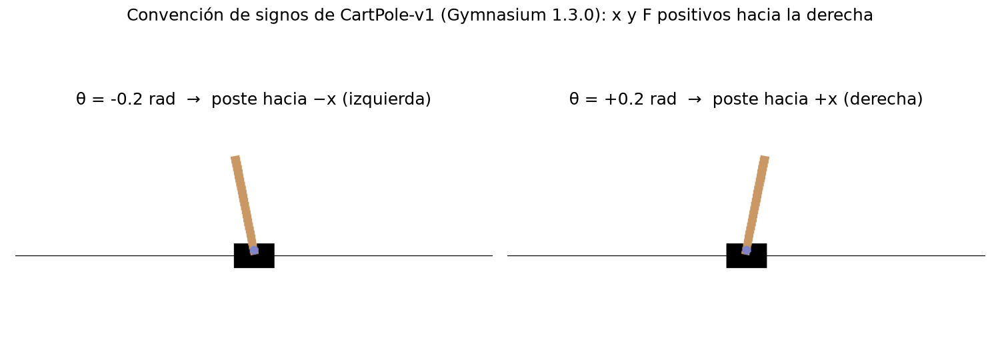

# 01 — El entorno: CartPole-v1 (Gymnasium 1.3.0) y la interfaz común

Este documento fija **qué simulador usamos, con qué constantes, con qué
convenciones y qué decisiones tomamos al envolverlo**. Todo lo que aquí se
afirma sobre Gymnasium está leído del código fuente instalado
(`gymnasium/envs/classic_control/cartpole.py`, v1.3.0) y verificado por un test,
que se indica en cada caso.

> Regla del proyecto: si un test de `tests/test_gymnasium_conventions.py` falla
> tras cambiar de versión de Gymnasium, **no se arregla el test**. Significa que
> el simulador cambió y hay que revisar el modelo y los controladores.

---

## 1. Versión

| Paquete | Versión | Nota |
|---|---|---|
| Python | 3.13.14 | entorno conda `base` |
| gymnasium | **1.3.0** | sucesor mantenido de OpenAI Gym (no se usa `gym`, que está deprecado) |
| pygame-ce | 2.5.8 | renderizado; Gymnasium 1.3.0 usa el fork `pygame-ce`, **no** `pygame` |

Pins exactos de todas las dependencias en [`requirements.txt`](../requirements.txt).
El test `test_installed_gymnasium_matches_pinned_version` falla si la versión
instalada no coincide con el pin.

## 2. Constantes físicas

Leídas en tiempo de ejecución del objeto `CartPoleEnv` (`cartpole_lab.params`),
nunca copiadas a mano. La tabla solo documenta los valores que tienen.

| Símbolo | Atributo en Gymnasium | Valor | Unidad | Nota |
|---|---|---|---|---|
| g | `gravity` | 9.8 | m/s² | |
| M | `masscart` | 1.0 | kg | masa del carro |
| m | `masspole` | 0.1 | kg | masa del poste |
| l | `length` | 0.5 | m | **mitad** de la longitud del poste (pivote → centro de masa). El poste mide 1 m |
| F_max | `force_mag` | 10.0 | N | la acción discreta aplica ±F_max |
| τ | `tau` | 0.02 | s | paso de integración = periodo de control (50 Hz) |
| — | `kinematics_integrator` | `"euler"` | — | Euler explícito |
| x_max | `x_threshold` | 2.4 | m | límite de terminación |
| θ_max | `theta_threshold_radians` | 12° = 0.20944 | rad | límite de terminación |
| M + m | `total_mass` | 1.1 | kg | derivada |
| m·l | `polemass_length` | 0.05 | kg·m | derivada |

Test: `test_internal_constants_match_documented_values`.

## 3. Estado, unidades y convenciones de signo (verificadas antes de LQR/MPC)

Estado **s = [x, ẋ, θ, θ̇]** en [m, m/s, rad, rad/s].

| Convención | Verificación |
|---|---|
| x > 0: carro a la **derecha** del centro | `test_render_positive_position_means_cart_right_of_center` (píxeles del render) |
| θ > 0: poste inclinado hacia **+x (derecha)**, θ medido desde la vertical | `test_render_positive_angle_means_pole_leans_right` (píxeles del render) |
| F > 0: empuja el carro hacia **+x** → ẍ > 0 y **θ̈ < 0** | `test_positive_force_accelerates_cart_right_and_rotates_pole_negative` |
| Con F = 0, un θ > 0 crece (el equilibrio vertical es inestable) | `test_gravity_amplifies_positive_angle` |
| Acción discreta 0 = empujar a la izquierda (−F_max), 1 = a la derecha (+F_max) | código de `step()`; `test_continuous_full_force_is_bitwise_identical_to_discrete_gymnasium` |



Consecuencia intuitiva para diseñar controladores: **si el poste cae hacia la
derecha (θ > 0), hay que empujar el carro hacia la derecha (F > 0)** para
"meterlo debajo" del centro de masa. Un controlador con ganancia de signo
contrario desestabiliza el sistema en pocos pasos.

**Discrepancia en la documentación de Gymnasium:** el docstring de `CartPoleEnv`
dice que la acción es "un `ndarray` de forma `(1,)`", pero el `action_space` real
es `Discrete(2)` (un entero escalar). Seguimos el código, no el docstring.

## 4. Ecuaciones de movimiento (tal como las implementa Gymnasium)

Gymnasium remite a Florian (2007), *Correct equations for the dynamics of the
cart-pole system* (https://coneural.org/florian/papers/05_cart_pole.pdf). Su
implementación corresponde al caso **sin rozamiento** (ni carro–raíl ni en el
pivote: no hay términos de fricción en el código):

$$
\text{temp} = \frac{F + m\,l\,\dot\theta^{2}\sin\theta}{M+m}
$$

$$
\ddot\theta = \frac{g\sin\theta - \cos\theta\cdot\text{temp}}
{l\left(\dfrac{4}{3} - \dfrac{m\cos^{2}\theta}{M+m}\right)}
\qquad
\ddot x = \text{temp} - \frac{m\,l\,\ddot\theta\cos\theta}{M+m}
$$

De dónde sale el 4/3: el poste se modela como una varilla uniforme de longitud
2l, así que su momento de inercia respecto al pivote es
I = m(2l)²/12 + m l² = (4/3) m l².

`cartpole_lab.dynamics.continuous_dynamics` transcribe estas ecuaciones
**en el mismo orden de operaciones** que Gymnasium.

## 5. Discretización: qué modelo usamos y por qué

La dinámica de §4 es de tiempo continuo, pero **Gymnasium no la integra de forma
exacta**. Cada `step()` aplica un paso de **Euler explícito** con τ = 0.02 s y la
fuerza constante durante el paso (retenedor de orden cero):

$$
s_{k+1} = s_k + \tau\, f(s_k, F_k)
$$

Las posiciones se actualizan con las velocidades *antiguas*, así que no es Euler
semi-implícito (Gymnasium ofrece esa variante, pero CartPole-v1 no la usa).

**Decisión:** la planta que "ve" cualquier controlador es este **mapa discreto**,
no la EDO continua. Por eso los controladores basados en modelo (LQR, MPC) usarán
el modelo discreto de Euler, `cartpole_lab.dynamics.euler_step`, y su
linealización A_d = I + τA_c, B_d = τB_c (paso 4). Esta linealización es
**exactamente** la del simulador en torno al equilibrio. La alternativa
"de libro", discretizar exactamente la EDO linealizada (A_d = e^{A_c τ}),
describiría mejor el péndulo físico real, pero **no** el simulador. La diferencia
es O(τ²) y se cuantificará en el paso 4.

Verificación: `test_euler_step_reproduces_gymnasium_step` exige **igualdad bit a
bit** entre `euler_step` y `CartPoleEnv.step()` para 400 pares
(estado, acción ±10 N) aleatorios, y
`test_euler_step_reproduces_gymnasium_for_intermediate_forces` hace lo mismo con
100 fuerzas intermedias aplicadas directamente sobre el CartPole crudo. También se comprueba la simetría física
f(−s, −F) = −f(s, F) (`test_dynamics_is_odd_symmetric`).

## 6. Recompensa, terminación y truncamiento (sin modificar)

| Elemento | CartPole-v1 | En `CartPoleTask` |
|---|---|---|
| Recompensa | +1 por paso, **incluido** el paso terminal | igual (`test_reward_is_the_unmodified_gymnasium_reward`) |
| Terminación | \|θ\| > 12° o \|x\| > 2.4 m (desigualdad estricta) | igual, más `info["termination_reason"]` = `"pole_angle_limit"` / `"cart_position_limit"` |
| Truncamiento | 500 pasos = 10 s (wrapper `TimeLimit`) | igual por defecto, con `termination_reason = "time_limit"`; configurable con `max_episode_steps` |
| Estado inicial | U(−0.05, 0.05) en las 4 variables | igual por defecto; opción de estado inicial exacto (§7.4) |

## 7. La interfaz común `CartPoleTask`: decisiones de diseño

`CartPoleTask` es un `gymnasium.Wrapper` alrededor del `CartPole-v1` oficial (se
crea con `gym.make`, así que conserva `TimeLimit`, `OrderEnforcing` y
`PassiveEnvChecker`). Todos los métodos, clásicos y RL, se ejecutan con el mismo
bucle `cartpole_lab.rollout.run_episode`.

### 7.1 Dos modos de actuador, y es la única diferencia permitida

CartPole-v1 **solo** admite dos acciones (±10 N, control *bang-bang*). PID, LQR y
MPC producen fuerzas continuas. Hay dos opciones y ninguna es neutral:

| `action_mode` | Acción | Para |
|---|---|---|
| `"discrete"` | {0, 1} → ±10 N | la API canónica de CartPole-v1 (compatibilidad con la literatura) |
| `"continuous"` | F ∈ [−10, 10] N | **todos los métodos del proyecto** (ver la decisión más abajo) |

El límite de ±10 N del modo continuo es el mismo F_max del entorno original. Así
ningún método dispone de más fuerza que otro: el actuador continuo contiene al
discreto como caso particular (con F = ±10 N la física es idéntica bit a bit,
ver §7.2).

**Decisión (2026-09-27): todos los métodos usan el actuador continuo
F ∈ [−10, 10] N.** Lo que cambia entre métodos es qué subconjunto de ese
intervalo puede elegir cada uno. Esto lo impone el algoritmo, no el entorno:

| Método | Fuerzas que puede elegir | ¿Continuo de verdad? | Motivo |
|---|---|---|---|
| PID, LQR, MPC, fuzzy | todo [−10, 10] N | sí | la ley de control es una función continua del estado |
| Q-learning, SARSA | conjunto finito de niveles de fuerza (p. ej. {−10, −5, 0, 5, 10} N; se fijará y justificará en los pasos 7-8) | no | la tabla Q necesita acciones indexables y la actualización usa max_a Q(s′, a) |
| DQN | el mismo conjunto finito | no | la red da un Q por acción y se elige con argmax. La versión continua sería otro algoritmo (DDPG, NAF), fuera del alcance acordado |
| Actor-crítico | todo [−10, 10] N: política gaussiana N(μ(s), σ(s)) recortada a ±10 N; en evaluación F = μ(s) | sí | el gradiente de la política solo requiere una densidad diferenciable |

- **Línea base canónica (ablación, opcional):** Q-learning, SARSA y DQN con solo
  {−10, +10} N, el CartPole-v1 de la literatura. Sirve para medir el efecto de la
  resolución del actuador.
- **Advertencia para la comparación de esfuerzo:** la recompensa de Gymnasium
  (+1 por paso) no penaliza la fuerza. Un agente RL continuo no tiene ningún
  incentivo para ahorrar esfuerzo, y puede acabar actuando casi como bang-bang.
  LQR y MPC, en cambio, minimizan el esfuerzo explícitamente en su función de coste.
  Si ocurre, no es un fallo del agente: es la lección "lo que optimizas es lo que
  obtienes". Se reportará como tal y no se corregirá cambiando la recompensa a
  posteriori.

### 7.2 Fuerza continua sin reimplementar la física

`CartPoleEnv.step()` hace `force = force_mag if action == 1 else -force_mag`.
Para aplicar una fuerza arbitraria F, el wrapper fija `force_mag = |F|`, pasa
`action = 1 si F ≥ 0, si no 0` y restaura `force_mag` al acabar el paso (en un
`finally`). **La física la sigue integrando el código de Gymnasium.** Se
descartó reimplementar `step()` porque habría dos simuladores que podrían
divergir.

- `force_mag` solo se usa en `step()` (comprobado en el código de la v1.3.0).
- `test_continuous_full_force_is_bitwise_identical_to_discrete_gymnasium`: con F = ±10 N, igualdad bit a bit con las acciones 0/1 originales.
- `test_arbitrary_continuous_force_follows_the_dynamics_model`: con F aleatoria, igualdad bit a bit con el modelo de §5.
- `test_force_mag_is_restored_after_each_step`.

### 7.3 Saturación del actuador

Si un controlador pide |F| > 10 N, se recorta a ±10 N. El recorte **no es
silencioso**: `info["force_requested"]`, `info["force"]` e `info["saturated"]`
lo registran, y `Trajectory.saturated` permite medir cuánto tiempo satura cada
método. Una acción no finita (NaN, ±inf) o con forma incorrecta lanza una
excepción; en modo discreto, cualquier cosa distinta de 0/1 (incluidos `True` y
`1.0`) también lanza.

### 7.4 Condición inicial exacta

`reset(options={"low": ..., "high": ...})` de Gymnasium solo acepta límites
**escalares** para el muestreo uniforme
(`test_reset_options_cannot_set_an_exact_initial_state`). Los *sanity checks* y
los ensayos de robustez necesitan condiciones iniciales exactas, así que
`reset(options={"initial_state": s0})`:

1. llama al `reset` oficial, que reinicia el RNG, el contador de `TimeLimit` y el indicador de terminación;
2. sobrescribe `unwrapped.state` con s0.

Si s0 está fuera de la región no terminal (|x| > 2.4 o |θ| > 12°), o no es finito,
se lanza `ValueError`. Gymnasium no se quejaría: el episodio moriría en el primer
paso y se confundiría con un fallo del controlador. Una condición inicial
*extrema pero válida* (p. ej. θ = 11° con θ̇ grande) sí se acepta. Si el
controlador no puede recuperarla, el episodio termina con un
`termination_reason` explícito.

### 7.5 Perturbaciones externas

`CartPoleTask(disturbance=ForcePulse(...))` añade una fuerza externa sobre el
**carro**, después de la saturación del actuador (es un empujón externo, no una
orden del controlador). Entra por la misma física de Gymnasium y su magnitud
tiene unidades claras: impulso J = F·duración [N·s]. `ForcePulse.at_time` exige
que los tiempos caigan en la malla k·τ, en lugar de redondearlos a escondidas.
La magnitud concreta del impulso para la Fase 3 se fijará allí.

### 7.6 Coste común de evaluación

La recompensa de CartPole-v1 solo mide supervivencia. Para comparar *calidad* de
control, cada paso registra además un coste de etapa idéntico para todos:

$$
c(s_k, F_k) = \left(\frac{x_k}{x_{\max}}\right)^2 + \left(\frac{\theta_k}{\theta_{\max}}\right)^2
+ \rho\left(\frac{F_k}{F_{\max}}\right)^2, \qquad \rho = 0.1
$$

Cada término vale 1 justo en el límite de fallo. Se evalúa con el estado
*anterior* al paso y la fuerza del actuador (sin la perturbación).

- **Este coste es para evaluar, no para diseñar.** Las matrices Q, R del LQR/MPC
  serán distintas. Si coincidieran, el LQR sería óptimo por construcción para la
  métrica y la comparación quedaría sesgada.
- ρ = 0.1 y los pesos nulos en las velocidades son **convenciones del proyecto**
  (ver §8), no un estándar.

### 7.7 Formato del estado

La observación oficial es float32 y el estado interno float64. El wrapper
devuelve la observación oficial convertida a **float64**, de forma (4,). Así
todos los métodos ven exactamente lo que vería un usuario de Gymnasium. El
redondeo float32 (~10⁻⁷ relativo) no afecta al control.

### 7.8 Errores explícitos en lugar de comportamiento indefinido

- `step()` antes de `reset()` o tras el fin del episodio → `RuntimeError`. Gymnasium solo avisa con un warning y sigue simulando un comportamiento "indefinido".
- Perturbación no finita → `ValueError` *antes* de tocar el simulador. Un NaN nunca hace terminar el episodio (toda comparación con NaN es falsa), así que llegaría silenciosamente hasta `time_limit` con una trayectoria corrupta.
- Si Gymnasium lanza una excepción a mitad de `step()`, el episodio queda invalidado y se exige `reset()`.
- `run_episode` con un controlador de modo distinto al de la tarea → `ValueError`.
- Los tests se ejecutan con `filterwarnings = error`: cualquier warning de Gymnasium o NumPy es un fallo.

## 8. Supuestos NO verificables desde la documentación oficial

Se listan para no presentarlos como estándar:

1. **Truco de `force_mag` (§7.2) y sobrescritura de `unwrapped.state` (§7.4).**
   Dependen de detalles de implementación de CartPole v1.3.0, no de su API
   pública. Los tests los verifican para esta versión; con otra versión hay que
   volver a correrlos.
2. **Actuador continuo acotado a ±10 N.** CartPole-v1 no define un actuador
   continuo. Elegir el mismo F_max es decisión nuestra, para no dar a los
   controladores clásicos más fuerza que a los agentes discretos.
3. **Pesos del coste de evaluación** (ρ = 0.1; ẋ y θ̇ con peso 0). Gymnasium no
   define límites para las velocidades, y cualquier escala de normalización sería
   arbitraria. ρ = 0.1 no tiene justificación teórica: hace que el esfuerzo pese
   menos que el error de estado. Se reportará siempre junto a los resultados.
4. **Umbrales de terminación como definición de "fallo".** Se heredan de
   CartPole-v1 (±12°, ±2.4 m). Son criterios de la tarea, no límites físicos del
   péndulo: un LQR podría recuperar ángulos mayores si el entorno lo permitiera.

## 9. Cómo verificarlo todo

```bash
python -m pytest -q                        # 89 tests (convenciones, modelo, wrapper, rollout, semillas)
python -m pytest --cov=cartpole_lab        # cobertura (99 %)
python scripts/verify_environment.py       # informe legible + figura de signos
```
