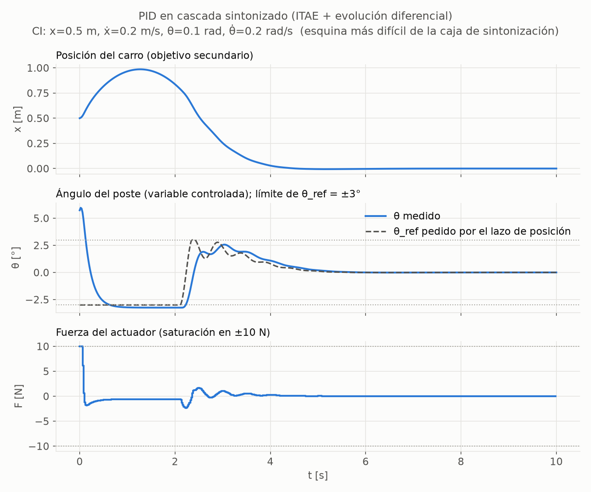

# 03 — Controlador PID en cascada

Código: [`controllers/pid.py`](../src/cartpole_lab/controllers/pid.py) (ley de control),
[`controllers/pid_tuning.py`](../src/cartpole_lab/controllers/pid_tuning.py) (sintonización y
análisis), [`scripts/tune_pid.py`](../scripts/tune_pid.py) (ejecución). Resultado:
[`results/tuning/pid.json`](../results/tuning/pid.json). Tests: [`tests/test_pid.py`](../tests/test_pid.py).

---

## 1. Por qué un solo PID no basta

El carro-péndulo tiene **una entrada** (F) y **dos cosas que regular** (θ y x). Un
PID sobre θ mantiene el poste vertical, pero no ve el carro, que deriva hasta
salirse del raíl (|x| > 2.4 m). La solución clásica es una **cascada**: el ángulo
es la variable controlada y la posición entra como objetivo secundario, en un lazo
externo más lento.

## 2. Estructura

```
                 lazo externo (PD, lento)                 lazo interno (PID, rápido)
 x, ẋ ──► θ_ref = sat±3°( −(Kp_x·x + Kd_x·ẋ) ) ──► e = θ − θ_ref ──► F = sat±10N( Kp_θ·e + Ki_θ·∫e dt + Kd_θ·θ̇ ) ──► CartPole
```

| Decisión | Qué | Por qué |
|---|---|---|
| Jerarquía por estructura | la posición solo puede pedir \|θ_ref\| ≤ 3° (25 % del ángulo de fallo) | el objetivo secundario nunca puede comprometer al primario, sin depender de pesos |
| Signo del lazo externo | x > 0 ⇒ θ_ref < 0 | para llevar el carro a la izquierda hay que inclinar el poste a la izquierda. Para inclinarlo, el lazo interno empuja primero a la **derecha**: comportamiento de **fase no mínima** (test `test_cart_right_of_target_first_pushes_right`) |
| Error de "acción inversa" | e = θ − θ_ref, en lugar de r − y | la planta tiene ganancia negativa (F > 0 ⇒ θ̈ < 0, ver doc 01 §3). Así todas las ganancias son positivas y cada término se lee físicamente: "si cae a la derecha, empuja a la derecha" |
| Derivada sobre la medida | Kd_θ·θ̇, no d(e)/dt | CartPole entrega θ̇ exacta, así que no hay que derivar numéricamente. Además se evita el "derivative kick" cuando cambia θ_ref. Con un encoder real habría que filtrar |
| Anti-windup | integración condicional: el integrador se congela si el actuador satura **y** el error empuja hacia la saturación | sin él, el integrador acumula un error que no puede corregirse y provoca sobreoscilación al desaturar (tests `test_anti_windup_*` y `test_integral_still_unwinds_*`) |

## 3. Método de sintonización y por qué

### 3.1 Ziegler–Nichols: inaplicable (demostrado, no supuesto)

El método de lazo cerrado de Z-N sube la ganancia de un control P hasta la
**ganancia última** K_u, donde el sistema pasa de estable a oscilación sostenida.
En el péndulo invertido **esa transición no existe**. Linealizando el simulador
(de hecho, su mapa de Euler), θ̈ = a·θ − b·F con a = 15.78 s⁻² y b = 1.463
(kg·m)⁻¹. Con F = Kp·θ:

- **Kp < a/b = 10.78 N/rad**: θ̈ = (a − bKp)θ con coeficiente positivo; el poste cae exponencialmente.
- **Kp > a/b**: θ̈ = −ω²θ, un oscilador **sin amortiguamiento**. Además, el Euler explícito del simulador lo amplifica, con |λ| = √(1 + ω²τ²) > 1.

El radio espectral es **≥ 1 para toda Kp**
(`test_p_only_angle_control_is_never_asymptotically_stable`, con 61 valores de 0 a
300 N/rad). La variante de lazo abierto (curva de reacción) exige una planta
estable, y esta no lo es.

### 3.2 Por qué no búsqueda manual

No es reproducible, y ante una audiencia la pregunta "¿por qué esas ganancias?"
no tendría respuesta.

### 3.3 Método elegido: optimización numérica de un criterio ITAE

Se usa **evolución diferencial** (SciPy): es global, no necesita gradientes y es
determinista con semilla fija. El simulador se trata como una caja negra, como se
sintonizaría un PID en una planta real, **sin usar el modelo linealizado**. Ese
modelo queda para el LQR, y así los dos métodos se distinguen de verdad. Por
velocidad se simula con una copia vectorizada del simulador que reproduce
**bit a bit** el rollout de Gymnasium, incluida la cuantización float32 de la
observación (`test_batch_simulator_reproduces_the_gymnasium_rollout`).

**Criterio** (media sobre 32 condiciones iniciales):

$$
J = \underbrace{\sum_k t_k\left(\frac{|\theta_k|}{\theta_{\max}} + \frac{|x_k|}{x_{\max}}\right)\tau}_{\text{ITAE}}
\;+\; w_u \sum_k \left(\frac{F_k}{F_{\max}}\right)^2 \tau, \qquad w_u = 0.1
$$

- **ITAE** (Graham & Lathrop, 1953) es un criterio clásico de sintonización de
  PID. El factor t castiga el error que persiste, lo que favorece asentar rápido
  y sin oscilación residual.
- Tras un **fallo** se imputa el error máximo (2 por paso) hasta el final del
  horizonte. Un fallo tardío cuesta menos que uno temprano y no hace falta
  inventar una penalización.
- Es **distinto** del coste de evaluación común (cuadrático, doc 01 §7.6), para no
  sintonizar el PID a medida de la métrica con la que luego se compara.

**Condiciones iniciales de sintonización:** 32 puntos uniformes en
±(0.5 m, 0.2 m/s, 0.1 rad, 0.2 rad/s), con semilla 2026. Esta caja contiene la
distribución oficial U(±0.05) y la amplía para que trabajen ambos lazos. Las
semillas de evaluación (1000–1049, distribución oficial) son disjuntas.

**Límites de búsqueda** (con argumento físico cuando lo hay):

| Ganancia | Rango | Argumento |
|---|---|---|
| Kp_θ | [0, 200] N/rad | con 200, un error de 2.9° ya satura el actuador |
| Ki_θ | [0, 200] N/(rad·s) | holgado, sin argumento previo |
| Kd_θ | [0, 40] N·s/rad | aislando el lazo de θ̇ (aproximación desacoplada, no una prueba para el lazo completo), el mapa discreto diverge si τ·b·Kd > 2, es decir Kd > 68. Solo acota la búsqueda; la estabilidad del resultado se verifica aparte (§4.3) |
| Kp_x, Kd_x | [0, 0.5] rad/m, rad·s/m | con 0.5, 10 cm de error ya piden el límite de 3° |

**Optimizador:** población de 100 candidatos (popsize 20 × 5 ganancias), un
máximo de 150 generaciones y **3 ejecuciones independientes** (semillas 0, 1 y 2),
para comprobar que el óptimo no es un accidente de la semilla.

## 4. Resultados

### 4.1 Ganancias y reproducibilidad del optimizador

| Semilla ED | J | Kp_θ | Ki_θ | Kd_θ | Kp_x | Kd_x | ¿Convergió? |
|---|---|---|---|---|---|---|---|
| 0 | 0.33732 | 200 (en el límite) | 170.9 | 34.36 | 0.2115 | 0.1989 | sí (120 gen.) |
| 1 | **0.32504** | 142.7 | 0.0006 | 26.22 | 0.1941 | 0.2103 | no, llegó a 150 gen. (mismo J con 5 cifras) |
| 2 | **0.32504** | **142.7** | **0.0005** | **26.22** | **0.1942** | **0.2103** | sí (143 gen.) ← seleccionada |

- **Dos de tres ejecuciones coinciden** en J y en las ganancias con 3–4 cifras.
- La semilla 0 quedó atrapada en un **óptimo local** peor, con Kp_θ en el límite y
  un término integral grande. El criterio es multimodal, y por eso se hacen varias
  ejecuciones.
- Coste computacional: 3 × ~150 generaciones × 100 candidatos × 32 episodios de
  500 pasos, entre ~70 y 110 s en total. El `nfev` que reporta SciPy cuenta
  llamadas vectorizadas, cada una con los 100 candidatos.

### 4.2 Hallazgo: el optimizador **anula el término integral** (Ki ≈ 0)

El resultado no se ha forzado, y es instructivo. En CartPole sin rozamiento y sin
perturbaciones constantes **no hay error estacionario que eliminar**. La I solo
añade un modo lento y retardo de fase, lo que empeora el ITAE. Por eso, el óptimo
de este criterio es, en la práctica, **un PD en cascada**.

**Decisión (2026-09-27): se presenta tal cual.** No se añade una perturbación
constante al escenario de sintonización para "darle papel" a la I. Hacerlo
cambiaría la tarea respecto a los demás métodos. El mensaje para la charla es:
*en este sistema, el mejor PID es un PD; la I sirve para otra cosa.*

**Cuándo sí importa la I:** ante una fuerza externa constante d (p. ej. un raíl
inclinado), el equilibrio del PD exige F = −d = Kp_θ·Kp_x·x, y queda un
**error de posición estacionario**:

$$
x_{ss} = -\frac{d}{K_{p\theta}\,K_{px}} = -3.61\ \text{cm por newton}
$$

La teoría coincide con la simulación (`test_without_integral_a_constant_force_leaves_the_predicted_position_offset`).
Con acción integral, el integrador solo se detiene cuando e = 0, es decir,
θ_ref = 0 y por tanto x = 0. El error desaparece: con **Ki = 80, un valor
ilustrativo no sintonizado**, queda en −0.02 cm tras 10 s
(`test_integral_action_removes_the_offset`).

**Consecuencia para la comparación:** el LQR estándar tampoco tiene acción
integral, así que tendría el mismo tipo de error estacionario. Las perturbaciones
de la Fase 3 son impulsos, no fuerzas constantes, por lo que ningún método tiene
ventaja por esto.

### 4.3 Estabilidad local (lazo linealizado en el equilibrio)

| Magnitud | Valor |
|---|---|
| \|λ\| de los modos físicos (PD) | 0.9659 (par complejo), 0.9717 (par complejo) |
| Radio espectral físico | **0.9717**: constante de tiempo dominante −τ/ln ρ = **0.70 s** |
| Modo del integrador | \|λ\| = 0.99999993 |

El modo del integrador está en λ ≈ 1 porque Ki ≈ 0: el integrador apenas
realimenta. Por eso el radio espectral del sistema completo (≈ 1) **engañaría**
si se reportara solo. Se reportan por separado
(`test_tuned_pid_has_no_divergent_mode_and_physical_modes_decay`). El propio
análisis se valida con un control negativo: unas ganancias que no vencen a la
gravedad dan ρ > 1 (`test_spectral_radius_of_a_truly_unstable_loop_is_detected`).
Este análisis es local y no dice nada sobre condiciones iniciales grandes, que es
lo que cubren los sanity checks.

### 4.4 Sanity checks en el CartPole-v1 real (Gymnasium, no el simulador por lotes)

**Positivo: N = 50 episodios**, con condiciones iniciales de la distribución
oficial (semillas 1000–1049):

| Métrica | Media ± desv. típica | Máximo |
|---|---|---|
| Supervivencia (500 pasos) | **50/50** | — |
| max \|θ\| en el último segundo | (2.7 ± 2.1)·10⁻⁶ ° | 8.4·10⁻⁶ ° |
| max \|x\| en el último segundo | (1.8 ± 1.3)·10⁻⁷ m | 5.6·10⁻⁷ m |
| Fracción de pasos con el actuador en su límite (±10 N) | 0 ± 0 | 0 |
| Esfuerzo Σ\|F\|τ | 1.11 ± 0.43 N·s | 1.63 N·s |

- Desde la **esquina más difícil** de la caja de sintonización
  (x = 0.5 m, ẋ = 0.2 m/s, θ = 0.1 rad, θ̇ = 0.2 rad/s) también estabiliza. Es la
  figura de abajo.
- Los tests repiten el chequeo con 20 semillas y tolerancias de 0.5° y 5 cm.

**Negativo: falla de forma explícita, no silenciosa:**

- Se usan los dos estados irrecuperables del protocolo común (`sanity.py`), y el
  PID termina en ambos con un motivo registrado, tras varios pasos y sin NaN:
  - θ = 0.15 rad con θ̇ = 2 rad/s;
  - carro lanzado al borde, x = 2.0 m con ẋ = 3.5 m/s.
- Por qué no es un defecto del PID: una búsqueda global de la mejor secuencia de
  fuerzas no encuentra ninguna que evite el fallo, ni siquiera por un 20 %. Para
  el carro hay además una cota física de momento lineal. Detalle en doc 04 §5.4.



Cómo leer la figura:
1. El actuador satura a +10 N para recuperar el poste (0.3 s). Ese empujón lleva
   el carro hasta ~1 m.
2. El lazo de posición pide entonces −3° (su límite), y el poste lo sigue durante
   ~2 s mientras el carro vuelve.
3. El carro se asienta hacia los 5 s.

El pequeño desfase sostenido entre θ (−3.2°) y θ_ref (−3°) es la firma de un
lazo interno sin integral: para mantener la inclinación hace falta fuerza, y un
PD solo la genera con error.

### 4.5 Puente hacia el LQR

Con Ki = 0 y sin saturación, la cascada es una **realimentación lineal de estado**
F = K·s con

$$
K = [K_{p\theta}K_{px},\; K_{p\theta}K_{dx},\; K_{p\theta},\; K_{d\theta}] = [27.7,\ 30.0,\ 142.7,\ 26.2]
$$

Es la misma forma que el LQR del paso 4. La diferencia no está en la estructura,
sino en **cómo se eligen las ganancias**: sintonización sobre simulación frente a
optimalidad sobre un modelo.

## 5. Supuestos sin base teórica (explícitos)

1. **Límite de θ_ref = 25 % del ángulo de fallo (3°).** Deja margen al lazo
   interno y mantiene el poste en la zona casi lineal. Es una elección de diseño.
2. **Peso del esfuerzo w_u = 0.1** en el criterio de sintonización. Evita
   soluciones de ganancia enorme que "tiritan" saturadas, casi gratis en ITAE.
3. **Pesos iguales para θ y x** en el ITAE, tras normalizarlos por sus límites.
   La jerarquía la pone la cascada.
4. **Caja de condiciones iniciales** ±(0.5, 0.2, 0.1, 0.2) y 32 muestras.
5. **Límites de búsqueda** de Ki_θ, Kp_x y Kd_x: holgados, sin argumento fino.
6. **Tolerancias del sanity check** (0.5° y 5 cm en el último segundo).
   Criterio de "estabilizado" propio del proyecto. La definición formal de
   tiempo de asentamiento llegará en la Fase 3.

## 6. Reproducir

```bash
python scripts/tune_pid.py         # ~2 min: sintoniza, verifica en Gymnasium, guarda JSON y figura
python -m pytest tests/test_pid.py
```

`test_tuned_record_matches_the_current_tuning_config` falla si se cambia
`TuningConfig` sin volver a sintonizar, para que nunca se usen ganancias obsoletas.
