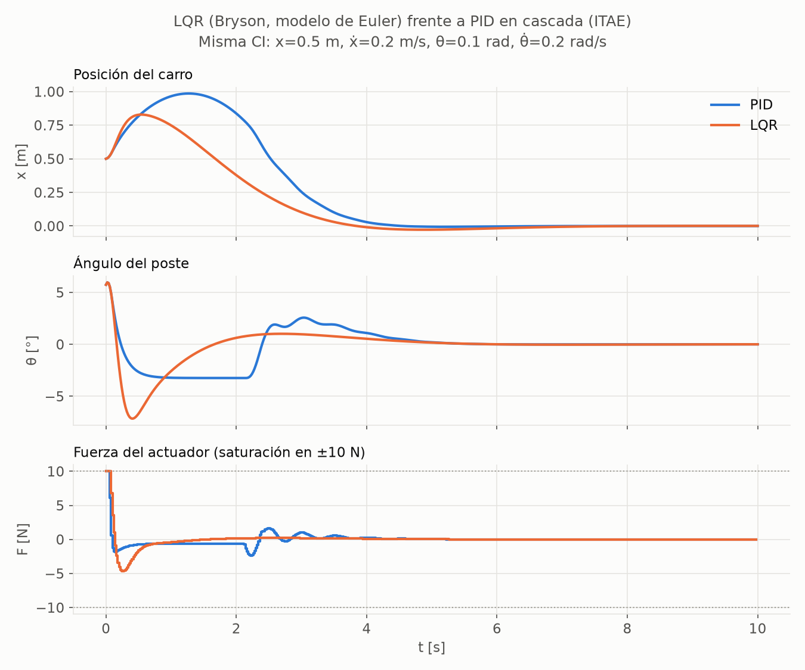

# 04 — Regulador lineal cuadrático (LQR)

Código: [`linearization.py`](../src/cartpole_lab/linearization.py) (A, B),
[`controllers/lqr.py`](../src/cartpole_lab/controllers/lqr.py) (diseño y controlador),
[`scripts/design_lqr.py`](../scripts/design_lqr.py) (ejecución y comparaciones). Resultado:
[`results/tuning/lqr.json`](../results/tuning/lqr.json). Tests:
[`test_linearization.py`](../tests/test_linearization.py), [`test_lqr.py`](../tests/test_lqr.py).

---

## 1. Idea

El PID se sintonizó mirando el sistema como una caja negra. El LQR hace lo
contrario: usa **el modelo** para calcular la mejor realimentación de estado
F = −K s para un criterio cuadrático explícito. En este sistema, la estructura
del controlador es la misma que la del PID equivalente (doc 03 §4.5). Cambia
**cómo se obtienen las ganancias**.

## 2. Linealización en el equilibrio vertical

A partir de las ecuaciones de Gymnasium (doc 01 §4), cerca de s = 0 se aproxima
sin θ ≈ θ, cos θ ≈ 1 y θ̇² sin θ ≈ 0 (término de segundo orden). Con M = m_c + m:

$$
\ddot\theta \approx a\,\theta - b\,F,\qquad
\ddot x \approx -c\,a\,\theta + \left(\tfrac{1}{M} + c\,b\right)F
$$

$$
D = l\left(\tfrac43 - \tfrac{m}{M}\right),\quad a = \frac{g}{D},\quad b = \frac{1}{M D},\quad c = \frac{m l}{M}
$$

$$
A_c = \begin{bmatrix} 0&1&0&0\\ 0&0&-ca&0\\ 0&0&0&1\\ 0&0&a&0 \end{bmatrix} =
\begin{bmatrix} 0&1&0&0\\ 0&0&-0.7171&0\\ 0&0&0&1\\ 0&0&15.7756&0 \end{bmatrix},\qquad
B_c = \begin{bmatrix} 0\\ 0.9756\\ 0\\ -1.4634 \end{bmatrix}
$$

- **Verificación:** las matrices analíticas coinciden con el jacobiano numérico
  del simulador con un error < 10⁻⁸
  (`test_analytic_continuous_jacobians_match_finite_differences`).
- **Autovalores de A_c:** {0, 0, ±3.97 s⁻¹}. El carro es un doble integrador, y
  el poste tiene un modo inestable con constante de tiempo de **0.25 s**: sin
  control, un error se multiplica por e cada cuarto de segundo.
- **Controlabilidad:** la matriz [B, AB, A²B, A³B] tiene rango 4.

## 3. Qué modelo discreto se usa y por qué

| Modelo | A_d | ¿Qué describe? |
|---|---|---|
| **Euler (elegido)** | I + τA_c, B_d = τB_c | **exactamente** la linealización del mapa que ejecuta Gymnasium (`test_euler_discretization_is_the_jacobian_of_the_simulator_step`) |
| ZOH exacta | e^{A_cτ}, ∫e^{A_cσ}dσ·B_c | el péndulo *físico* con fuerza constante durante τ, pero no el simulador |
| Continuo (CARE) | — | el LQR "de libro", aplicado a 50 Hz |

La discrepancia entre Euler y ZOH es O(τ²): ‖A_zoh − A_euler‖_F = 0.0045, y cae
unas 4 veces al dividir τ entre 2 (`test_euler_and_zoh_differ_at_second_order_in_tau`).
Para ver si importa, **se diseñan los tres y se evalúan sobre la planta real**
(la de Euler):

| Diseño | K | Subóptimo sobre el simulador (traza de P) | Criterio LQR desde la CI difícil |
|---|---|---|---|
| **Euler** | [−7.04, −11.01, −93.99, −18.78] | **0 %** (óptimo por construcción) | 62.27 |
| ZOH exacta | [−7.02, −10.77, −91.64, −17.92] | 0.15 % | 62.30 |
| Continuo (CARE) | [−8.33, −12.68, −105.39, −20.14] | 1.23 % | 62.50 |

**Conclusión:** con τ = 0.02 s (λτ ≈ 0.08) los tres estabilizan y la diferencia
es pequeña. Aun así, **el diseño sobre Euler es el único óptimo para el sistema
que se simula**, y es gratis, así que es el que se usa. El test
`test_lqr_gain_is_optimal_against_any_other_stabilizing_gain` verifica que
P_K − P ⪰ 0 para las otras dos ganancias. Esa es la propiedad que *define* al LQR.

## 4. Criterio y elección de Q, R

$$
J = \sum_{k\ge0} \left(s_k^\top Q\, s_k + R\,F_k^2\right),\qquad
F_k = -K s_k,\quad K = (R + B^\top P B)^{-1} B^\top P A
$$

P es la solución de la ecuación algebraica de Riccati discreta
(`scipy.linalg.solve_discrete_are`), y J(s₀) = s₀ᵀPs₀ es el coste óptimo.

**Regla de Bryson** (Bryson & Ho, 1975): Q_ii = 1/(máximo *aceptable* de s_i)²
y R = 1/(máxima fuerza *aceptable*)². Hace adimensional cada término y
convierte la elección de Q y R en especificaciones físicas en lugar de números
mágicos. Solo importa la escala relativa: multiplicar Q y R por el mismo factor
no cambia K (`test_design_is_invariant_to_scaling_Q_and_R_together`).

| Variable | Máximo aceptable | Peso | Justificación |
|---|---|---|---|
| θ | **8.1°** (0.1415 rad) | q_θ = 49.92 | cos θ ≥ 0.99: zona donde el modelo lineal con el que se diseña tiene error ≤ 1 %. **Base física** |
| x | **1.2 m** | q_x = 0.694 | la mitad del semirraíl, dejando la otra mitad de margen ante perturbaciones. **SUPUESTO** (el "mitad" es una elección) |
| F | **10 N** | R = 0.01 | el límite del actuador: el diseño lineal debería saturar poco |
| ẋ, θ̇ | — | 0 | Gymnasium no las acota, y cualquier escala sería inventada. K las usa igualmente |

**Diferencia con el coste de evaluación común** (doc 01 §7.6): allí las escalas
son los límites de *fallo* (2.4 m, 12°) y el peso del esfuerzo es 10 veces menor.
Aquí son tolerancias de *diseño*, más estrictas. Hay que decirlo con honestidad:
**el LQR minimiza un criterio de la misma familia (cuadrática) que ese coste de
evaluación**, así que en esa métrica concreta tiene una ventaja estructural,
aunque los pesos difieran. Por eso la Fase 3 no se apoya en una única métrica.

## 5. Resultados

### 5.1 Ganancias y lazo cerrado

$$
K = [-7.04,\ -11.01,\ -93.99,\ -18.78]
\quad\Rightarrow\quad
F = 7.04\,x + 11.01\,\dot x + 93.99\,\theta + 18.78\,\dot\theta
$$

- **Signos:** todos los coeficientes de F son positivos. Es la misma intuición
  física que en el PID, incluido el empujón inicial "hacia el lado equivocado"
  (fase no mínima) (`test_feedback_signs_match_the_physical_intuition`).
- **Lazo cerrado:** |λ| = 0.856 (par complejo, modo del poste) y 0.984 (par
  complejo, modo del carro). La constante de tiempo dominante es **1.28 s**,
  frente a 0.70 s del PID.
- **Validación del modelo en simulación:** cerca del equilibrio, el coste medido
  sobre la trayectoria no lineal coincide con la predicción de Riccati s₀ᵀPs₀,
  con error < 0.1 %
  (`test_lqr_criterion_on_a_trajectory_matches_the_riccati_prediction_near_equilibrium`).

### 5.2 Las perillas: R frente a Q

| Cambio | Modos del poste \|λ\| | Modo del carro: constante de tiempo | Desde la CI difícil |
|---|---|---|---|
| R × 0.1 (esfuerzo barato) | 0.768 | 1.27 s | pico de 10 N; 1.8 % del tiempo en el límite |
| **R × 1** | **0.856** | **1.28 s** | pico de 10 N; 0.8 % en el límite |
| R × 10 (esfuerzo caro) | 0.903 | 1.35 s | pico de 8.7 N; nunca en el límite |
| q_x × 4 | 0.855 | 0.88 s | — |
| q_x × 16 | 0.855 | 0.59 s | — |

**Lección (verificada, no intuida):**
- **R** controla lo agresivo que es el control del *poste*: al abaratar el
  esfuerzo, ese modo se acelera.
- La lentitud del *carro* casi no depende de R, sino del compromiso x–θ fijado
  en **Q**. Pedir más precisión en x (q_x × 16) baja su constante de tiempo de
  1.28 s a 0.59 s.

### 5.3 "Óptimo" siempre es relativo a un criterio: PID frente a LQR

Cada método se evalúa con el criterio del otro, sobre **32 condiciones iniciales
nuevas** (misma caja que la sintonización del PID, semilla 2027), fuera de
muestra para ambos. Comparación **pareada** (misma condición inicial):

| | Criterio ITAE (el del PID) | Criterio cuadrático (el del LQR) |
|---|---|---|
| PID | **0.334 ± 0.273** | 8.51 ± 7.07 |
| LQR | 0.446 ± 0.274 | **7.02 ± 6.27** |
| Pareado | el PID gana en **31/32** CI; el LQR es, de media, un 59 % peor | el LQR gana en **32/32** CI; el PID es, de media, un 33 % peor |

Las desviaciones típicas se solapan porque la variabilidad *entre condiciones
iniciales* es mucho mayor que la diferencia *entre métodos*. Por eso se reporta
la comparación pareada, que elimina esa variabilidad. **Mensaje para la charla:
cada método gana con su propio criterio. "Mejor controlador" no tiene sentido
sin decir mejor según qué.**



Cómo leer la figura:
- El LQR inclina más el poste (hasta −7°; no tiene el límite de 3° del PID, pero
  queda dentro de su tolerancia de diseño de 8.1°).
- A cambio, el carro se aleja menos (0.82 m frente a 0.98 m) y vuelve antes.
- La cola lenta del modo del carro (1.28 s) es lo que el ITAE, que pondera el
  tiempo, castiga.

### 5.4 Sanity checks en el CartPole-v1 real

**Positivo: N = 50** (semillas 1000–1049, distribución oficial):

| Métrica | LQR | PID (referencia) |
|---|---|---|
| Estabilizados | **50/50** | 50/50 |
| max \|θ\| en el último segundo | (5.6 ± 4.2)·10⁻⁴ ° | (2.7 ± 2.1)·10⁻⁶ ° |
| max \|x\| en el último segundo | (5.6 ± 3.6)·10⁻⁵ m | (1.8 ± 1.3)·10⁻⁷ m |
| Fracción de tiempo en el límite de fuerza | 0 | 0 |
| Esfuerzo Σ\|F\|τ | **0.33 ± 0.20 N·s** | 1.11 ± 0.43 N·s |

El LQR converge más despacio (residuos mayores al cabo de 10 s), pero con
**un tercio del esfuerzo**. También estabiliza desde el estado difícil de referencia.

**Negativo:** falla de forma explícita en los dos estados irrecuperables del
protocolo común (`sanity.py`).

**Cómo se sabe que son irrecuperables para cualquier controlador** (y no que el
controlador sea malo). Esta sección se corrigió en este paso, ver §6.

| Estado | Cota física | Búsqueda global de rescate |
|---|---|---|
| Poste cayendo: θ = 0.15 rad, θ̇ = 2 rad/s | — | la mejor secuencia hallada llega a **1.73×** el límite |
| Carro al borde: x = 2.0 m, ẋ = 3.5 m/s | centro de masas: x ≥ **2.66 m** > 2.4 m | la mejor secuencia hallada llega a **1.45×** el límite |
| Control positivo: estado difícil de referencia | x ≥ 0.50 m (no concluye nada) | **0.50** (< 1): la búsqueda sí encuentra rescate |

- **Cota física:** la única fuerza horizontal externa es F, así que el centro de
  masas cumple M·ẍ_c = F (verificado con las ecuaciones de Gymnasium,
  `test_center_of_mass_obeys_newton_with_only_the_actuator_force`). Con
  |F| ≤ 10 N frena como mucho a F_max/M, y su distancia de frenado tiene una cota
  inferior. Es un argumento de tiempo continuo, así que solo se usa con márgenes
  amplios.
- **Búsqueda global:** evolución diferencial sobre las 25 fuerzas de los primeros
  0.5 s, con el modelo exacto del simulador, minimizando la violación máxima de
  los límites de x o de θ. Es **evidencia numérica, no demostración**: el
  optimizador podría no hallar el óptimo. Por eso se exige un margen > 20 % y se
  valida con el control positivo.

## 6. Correcciones metodológicas hechas en este paso

**Estados irrecuperables.** El estado del carro usado hasta ahora (x = 2.2 m,
ẋ = 2 m/s) se justificaba con una cuenta cinemática que ignoraba el acoplamiento
carro–poste, y con un test que solo probaba que *una* estrategia (fuerza
constante) fallaba. La revisión independiente encontró que, **mirando solo el
límite del carro**, una secuencia de fuerzas óptima se queda a ~1 ULP de 2.4 m.
Esa secuencia hace caer el poste en el paso 9, así que el estado sí era
irrecuperable con el criterio completo (x o θ). Aun así, su margen por el lado
del carro era de ~1 cm, un caso frontera frágil. Se sustituyó por
x = 2.0 m, ẋ = 3.5 m/s, con 26 cm de margen en la cota física, y se añadieron la
cota y la búsqueda global con su control positivo.

**Métrica de saturación.** Al revisar el barrido de R apareció un "pico de 10 N con 0 % de saturación".
El indicador `saturated` del wrapper solo se activa si el controlador pide más de
10 N, pero el PID y el LQR ya recortan internamente, así que nunca lo activaban.
Se sustituyó por una métrica física, **`Trajectory.fraction_at_force_limit`**
(|F| = F_max, lo recorte quien lo recorte), y se regeneraron los registros del
PID y del LQR. En el PID, el valor reportado (0 %) resultó ser correcto para las
condiciones iniciales oficiales, pero por casualidad: la métrica estaba mal.

## 7. Supuestos sin base teórica (explícitos)

1. **x aceptable = mitad del semirraíl (1.2 m).**
2. **Pesos nulos en ẋ y θ̇.** Es una elección conservadora, para no inventar
   escalas.
3. La tolerancia de linealización del 1 % (cos θ ≥ 0.99) tiene base física, pero
   el valor "1 %" también es una elección.
4. El LQR ignora la saturación en el diseño. Es óptimo solo en la zona lineal;
   lejos de ella no hay garantías (lo cubren los sanity checks, no la teoría).

## 8. Reproducir

```bash
python scripts/design_lqr.py      # segundos: diseño, comparaciones, sanity check, figura
python -m pytest tests/test_linearization.py tests/test_lqr.py
```
