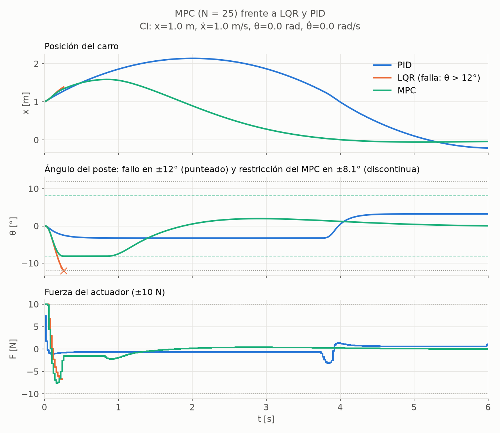

# 05 — Control predictivo (MPC) lineal

Código: [`controllers/mpc.py`](../src/cartpole_lab/controllers/mpc.py),
[`scripts/design_mpc.py`](../scripts/design_mpc.py). Resultado:
[`results/tuning/mpc.json`](../results/tuning/mpc.json). Tests: [`tests/test_mpc.py`](../tests/test_mpc.py).

---

## 1. Idea: el LQR que "ve" los límites

El LQR calcula una ley F = −K s pensando que el mundo es lineal y no tiene
límites. Luego la realidad recorta la fuerza a ±10 N y termina el episodio si
|θ| > 12°, y el LQR no lo sabía. El MPC resuelve **en cada paso** (cada 20 ms) un
problema de optimización sobre los próximos N pasos que **incluye los límites
como restricciones**. Aplica solo la primera fuerza y repite con la nueva medida
(*horizonte deslizante*).

$$
\begin{aligned}
\min_{F_0..F_{N-1}}\;& \sum_{i=0}^{N-1}\left(s_i^\top Q s_i + R F_i^2\right) + s_N^\top P\, s_N + w\sum_{i}\left(\sigma_{x,i} + \sigma_{\theta,i}\right)\\
\text{s.a.}\;& s_{i+1} = A s_i + B F_i \quad\text{(modelo de Euler, el mismo del LQR)}\\
& |F_i| \le 10\ \text{N} \quad\text{(dura: es física)}\\
& |x_i| \le 2.4 + \sigma_{x,i},\quad |\theta_i| \le 8.1^\circ + \sigma_{\theta,i},\quad \sigma \ge 0 \quad\text{(blandas)}
\end{aligned}
$$

## 2. Decisiones de diseño y por qué

| Decisión | Valor | Justificación |
|---|---|---|
| Pesos | Q, R y P **heredados del LQR** | la única diferencia con el LQR son el horizonte y las restricciones, así que la comparación es limpia |
| Coste terminal | P de la ecuación de Riccati | con restricciones inactivas, F₀ = −K s₀ **exactamente** (Bellman). Verificado: diferencia relativa < 10⁻⁵ (`test_equals_lqr_when_no_constraint_is_active`). En el sanity check, MPC y LQR dan los mismos números |
| Restricción de θ | **8.1°**, no 12° | margen de seguridad (§4.2). Mismo criterio de validez del modelo lineal que en el LQR (cos θ ≥ 0.99); no se ajustó a los resultados |
| Restricción de x | 2.4 m, sin margen | el error del modelo en x es de segundo orden si θ se queda en la zona lineal. **SUPUESTO**: funcionó en los ensayos, no está demostrado |
| Restricciones de estado | **blandas**, penalización L1 con w = 10⁴ | si fueran duras, el problema podría ser infactible (p. ej. si θ₀ ya supera 8.1°) y el controlador no tendría respuesta (`test_hard_constraints_can_be_infeasible_but_soft_ones_always_solve`). Con L1 y w mayor que los multiplicadores de Lagrange, la penalización es **exacta** (Kerrigan & Maciejowski, 2000): si el problema duro es factible, la solución coincide (tests `test_soft_constraints_match_hard_*` y `test_slack_weight_exceeds_*`) |
| Horizonte | **N = 25** (0.5 s) | §4.1 |
| Modelado y solver | **CVXPY + Clarabel** | §4.3. El problema se compila una sola vez, con s₀ como parámetro, y en cada paso solo se re-resuelve |
| Fallo del solver | excepción | nunca se devuelve una fuerza de un problema no resuelto (`test_solver_failure_raises_*`) |

## 3. Diagnóstico que motivó el diseño

En una primera exploración, desde un carro desplazado y lanzado (x = 1 m,
ẋ = 1 m/s), **el PID estabilizaba y el LQR fallaba**, a pesar de que el estado es
físicamente recuperable. La causa: para frenar el carro, el LQR inclina el poste
de forma agresiva (+10 N durante 3 pasos) y lo pasa de 12°. El PID sobrevivía
gracias a su límite de θ_ref de 3°: lento (el carro llega a 2.14 m), pero seguro.
Un MPC con la restricción de θ puesta *en el límite de fallo* terminaba en 12.005°:
planificaba justo hasta el borde, y el pequeño error del modelo lineal lo
cruzaba.

## 4. Elecciones basadas en datos

### 4.1 Horizonte

Sobre los 12 estados recuperables cerca de la frontera (`NEAR_BOUNDARY_INITIAL_STATES`),
todos los horizontes estabilizan los 12. Por eso N se elige con un criterio más
fino: el coste en lazo cerrado frente a N = 50, en el **peor** caso.

| N | Coste frente a N = 50: media / peor caso | Tiempo de resolución: media / p99 / máximo |
|---|---|---|
| 3 | −0.08 % / +1.30 % | 2.3 / 3.7 / 6.5 ms |
| 5 | +1.43 % / +6.95 % | 2.4 / 3.3 / 4.4 ms |
| 10 | +0.38 % / +1.47 % | 3.0 / 4.2 / 5.5 ms |
| **25** | **+0.03 % / +0.18 %** | **4.5 / 6.4 / 7.4 ms** |
| 50 | referencia | 6.6 / 9.6 / 12.0 ms |

**Criterio:** el menor N cuyo peor caso queda a menos del 1 % de N = 50. Resulta
N = 25; el umbral del 1 % es una elección. Su peor tiempo, 7.4 ms, es el 37 % del
periodo de control de 20 ms.

**Lección:** con un buen coste terminal (el P del LQR), incluso N = 3 estabiliza.
El coste terminal resume "todo lo que viene después", y el horizonte solo tiene
que manejar las restricciones inmediatas. La dependencia con N no es monótona
(N = 5 es peor que N = 3), un recordatorio de que un horizonte finito es una
aproximación.

### 4.2 Margen de seguridad en la restricción de θ

| Restricción de θ | Estabilizados (de 12) | Máximo \|θ\| alcanzado |
|---|---|---|
| 12.00° (= límite de fallo) | **6**, lo mismo que el LQR | 12.005° → fallo |
| 11.99° | 12 | 11.995° |
| 10.0° | 12 | 11.83°\* |
| **8.1°** | **12** | 11.83°\* |

\* El máximo de 11.83° viene del estado inicial θ₀ = 11.75°, que ya empieza por
encima de la restricción. La holgura blanda le permite actuar igualmente.

**Lección:** no hace falta un margen *grande*: en esta simulación ideal basta
0.01°. Lo que hace falta es **no planificar sobre el límite de fallo**. Se usan
8.1° a propósito, siendo conservadores:
- por coherencia con el criterio del LQR;
- porque perturbaciones, ruido o un modelo peor que el de una simulación
  perfecta exigirían más margen.

El posible coste de ese conservadurismo (una recuperación más lenta) se medirá
en la Fase 3.

### 4.3 Solver: Clarabel frente a OSQP

Recomendé inicialmente OSQP (ADMM), el habitual en MPC embebido por su warm
start. Los datos lo descartaron. Comparación sobre 6 problemas, 4 de ellos
difíciles (restricciones blandas muy activas), con 5 repeticiones cada uno:

| Solver | Resueltos | Error frente a Clarabel | Tiempo medio | **Peor caso** |
|---|---|---|---|---|
| **Clarabel** (punto interior) | **6/6** | — | 4.9 ms | **6.9 ms** |
| OSQP (ε = 10⁻⁷, polish, warm start) | 5/6 (1 agota iteraciones) | 2.9·10⁻⁵ N | 82.7 ms | **175 ms (8.8 veces el periodo de 20 ms)** |

**En tiempo real importa el peor caso, no la media.** Un controlador que a veces
tarda 175 ms en un sistema de 20 ms no sirve, por mucho que casi siempre sea
rápido. (Con OSQP menos preciso, ε = 10⁻⁵, en la exploración inicial todos
resolvían, pero con errores de hasta 2.5·10⁻³ N y peores tiempos).

## 5. Resultados

### 5.1 Comparación cerca de la frontera (12 estados recuperables)

| Controlador | Estabilizados |
|---|---|
| PID en cascada | 8/12 |
| LQR | 6/12 |
| **MPC** | **12/12** |



Cómo leer la figura:
- El LQR cruza 12° a los 0.26 s.
- El MPC lleva el poste **exactamente hasta su restricción** (−8.1°), lo
  mantiene ahí ~0.6 s ("cabalga" la restricción) y devuelve el carro al centro
  hacia los 4 s.
- El PID sobrevive con su límite de 3°, pero el carro llega a 2.14 m, a 26 cm
  del borde.

**Advertencia metodológica:** los 12 estados se eligieron explorando una malla
gruesa con PID y LQR *antes* de probar el MPC con margen. Aun así, no son una
muestra representativa: están donde los métodos difieren. El mapa sistemático
de la región de atracción de todos los métodos corresponde a la Fase 3.

### 5.2 Sanity checks en el CartPole-v1 real

- **Positivo: N = 50** (semillas 1000–1049): **50/50** estabilizados. Todos los
  estadísticos coinciden con los del LQR:
  - max |θ| en el último segundo: (5.6 ± 4.2)·10⁻⁴ °;
  - esfuerzo: 0.33 ± 0.20 N·s.

  Es lo esperado: cerca del equilibrio no hay restricciones activas, y
  entonces MPC = LQR.
- **Estado difícil de referencia:** estabiliza.
- **Negativo:** falla de forma explícita en los dos estados irrecuperables del
  protocolo común.

## 6. Supuestos sin base teórica (explícitos)

1. **Restricción de x en 2.4 m sin margen.**
2. **θ_lim = 8.1°:** conservador a propósito. En esta simulación bastaría 0.01° (§4.2).
3. **Peso de las holguras w = 10⁴:** se comprueba que supera a los
   multiplicadores en los casos ensayados, no para todo estado posible.
4. **Criterio del 1 % para elegir N.**
5. El modelo sigue siendo lineal: lejos del equilibrio, el MPC "cree" una
   dinámica que no es la real. Los márgenes lo compensan en la práctica. Un MPC
   no lineal (p. ej. do-mpc/CasADi) lo resolvería en su origen, a costa de más
   complejidad y cálculo; queda fuera del alcance acordado.

## 7. Reproducir

```bash
python scripts/design_mpc.py      # ~6 min: barridos, solvers, comparación, sanity check, figura
python -m pytest tests/test_mpc.py
```
