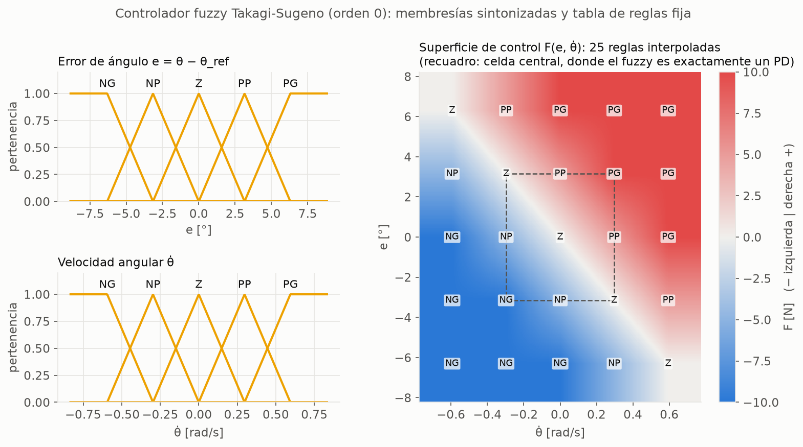
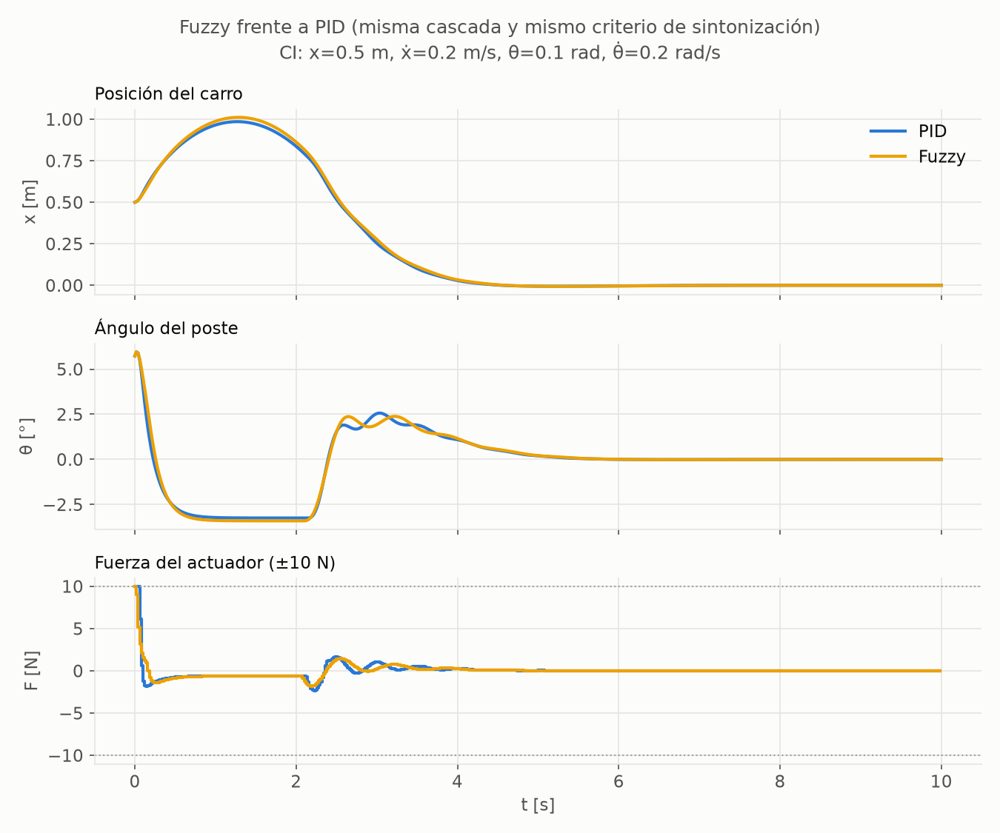

# 06 — Controlador fuzzy (Takagi-Sugeno de orden 0)

Código: [`controllers/fuzzy.py`](../src/cartpole_lab/controllers/fuzzy.py) (reglas, membresías, inferencia),
[`controllers/fuzzy_tuning.py`](../src/cartpole_lab/controllers/fuzzy_tuning.py) (sintonización),
[`scripts/tune_fuzzy.py`](../scripts/tune_fuzzy.py). Resultado:
[`results/tuning/fuzzy.json`](../results/tuning/fuzzy.json). Tests: [`tests/test_fuzzy.py`](../tests/test_fuzzy.py).

---

## 1. Idea

En lugar de una fórmula, el controlador se escribe con **reglas en lenguaje natural**:

> *SI el poste está muy inclinado a la derecha Y cae deprisa hacia la derecha,
> ENTONCES empuja fuerte a la derecha.*

Un mecanismo de inferencia **mezcla** las reglas cuando la situación está a medio
camino entre varias. Es la forma de convertir en controlador el conocimiento de
un experto humano que no sabe escribir ecuaciones.

## 2. Por qué Sugeno de orden 0 (y no Mamdani ni una librería)

| | Mamdani | **Sugeno de orden 0 (elegido)** | scikit-fuzzy |
|---|---|---|---|
| Reglas y membresías de entrada | sí | **sí, idénticas** | sí |
| Salida de cada regla | un conjunto difuso de fuerzas | **un número** ("fuerte a la derecha" = +U) | — |
| Cálculo de la salida | agregación + centroide | **media ponderada** | oculto en la librería |
| Simulación por lotes para sintonizar | difícil | **directa** | lenta |

La lógica que se explica es la misma. Un Sugeno de orden 0 equivale a un Mamdani
cuyos conjuntos de salida son picos (singletons), así que el centroide se reduce
a una media ponderada. No añade dependencias: ~60 líneas de numpy.

## 3. Diseño, paso a paso

**Estructura:** la misma cascada que el PID (doc 03). El lazo externo pide una
inclinación θ_ref, limitada a ±3°, para llevar el carro al centro. El fuzzy
**sustituye solo al lazo interno**, así que la comparación con el PID es directa.
No tiene término integral: el PID ya mostró que en este sistema la I no aporta.

**1) Fuzzificación.** Entradas: e = θ − θ_ref y θ̇, normalizadas por sus factores
de escala (e/E, θ̇/D). Cada una se describe con **5 etiquetas** (NG, NP, Z, PP, PG).
Las membresías son **triangulares y equiespaciadas**, con "hombros" en los
extremos: todo lo que supera "grande" sigue siendo grande. Así forman una
**partición de la unidad**, es decir, en cada punto las pertenencias suman 1:
ningún estado queda sin regla y ninguno se cuenta dos veces
(`test_memberships_form_a_partition_of_unity`).

**2) Reglas.** Tabla 5×5 **escrita a mano desde la física y nunca optimizada**. Es
la tabla clásica de MacVicar-Whelan: consecuente = sat(i + j), con i, j ∈ {−2..2}
los índices de las etiquetas.

| e \ θ̇ | NG | NP | Z | PP | PG |
|---|---|---|---|---|---|
| **PG** | Z | PP | PG | PG | PG |
| **PP** | NP | Z | PP | PG | PG |
| **Z** | NG | NP | Z | PP | PG |
| **NP** | NG | NG | NP | Z | PP |
| **NG** | NG | NG | NG | NP | Z |

Se lee: **"la fuerza sigue a hacia dónde cae el poste, más lo deprisa que cae"**.
Si ambos van al mismo lado, fuerte. Si se compensan (inclinado a la derecha pero
volviendo rápido: esquina superior izquierda), no hagas nada. La tabla es simétrica
izquierda-derecha y monótona (`test_rule_table_encodes_the_physical_intuition`).

**3) Inferencia y salida.**
- La activación de cada regla es μ_e,i · μ_θ̇,j: el "Y" como producto.
- La salida es la media ponderada de los consecuentes, multiplicada por U [N]:

$$
F = U\cdot\frac{\sum_{ij}\mu_{e,i}\,\mu_{\dot\theta,j}\,c_{ij}}{\sum_{ij}\mu_{e,i}\,\mu_{\dot\theta,j}}
$$

**Qué calcula realmente**, verificado con tests:
- En cada nodo de la tabla habla **una sola regla** (`test_at_grid_nodes_a_single_rule_speaks`).
- Entre nodos, el controlador **interpola bilinealmente** la tabla.
- En la **celda central** (|e/E|, |θ̇/D| ≤ 0.5) es **exactamente un PD**,
  F = U·(e/E + θ̇/D), con Kp = U/E y Kd = U/D
  (`test_near_the_origin_the_fuzzy_controller_is_exactly_a_pd`).
- Fuera de la celda central, satura suavemente hasta ±U.

**Las reglas no inventan una ley exótica: son una forma de *escribir con palabras*
un PD con saturación suave.**



## 4. Sintonización: exactamente el protocolo del PID

- **Mismo protocolo:** mismo criterio (ITAE + esfuerzo), mismas 32 condiciones
  iniciales, mismo horizonte, mismo optimizador y mismo presupuesto (3 semillas ×
  150 generaciones × 100 candidatos). Un test verifica que la configuración solo
  difiere en los límites de búsqueda.
- **Qué se sintoniza:** los 3 factores de escala (E, D, U) **y**, como hizo el PID,
  las 2 ganancias del lazo externo. Reutilizar las del PID dejaría al fuzzy en
  desventaja, porque se sintonizaron junto con *otro* lazo interno. **La tabla y
  la forma de las membresías no se tocan.**
- **Límites:** E ∈ [0.01, 0.21] rad (de 0.6° a 12°); D ∈ [0.05, 3] rad/s;
  **U ∈ [0.5, 10] N**, de modo que "empujar fuerte" significa como mucho lo que da
  el actuador.

## 5. Resultados

### 5.1 Parámetros y reproducibilidad

- **Las 3 ejecuciones del optimizador llegan exactamente al mismo punto**
  (J = 0.33445). Ninguna cumple la tolerancia de convergencia antes de las 150
  generaciones, pero coinciden en todas las cifras.
- **Parámetros:** E = 0.110 rad (6.3°), D = 0.594 rad/s, **U = 10 N, justo en el
  límite**, Kp_x = 0.168, Kd_x = 0.190.
- **PD equivalente en la celda central:** Kp = 90.9 N/rad y Kd = 16.8 N·s/rad,
  frente a 142.7 y 26.2 del PID.
- **Lazo cerrado:** radio espectral de 0.973, con constante de tiempo dominante
  de 0.73 s (el PID tiene 0.70 s).

### 5.2 Hallazgo: con libertad total, el fuzzy *se convierte* en el PID

U terminó en su límite de 10 N. Para saber si ese límite explica la diferencia con
el PID, se re-sintonizó permitiendo U ≤ 40 N (experimento registrado en el JSON):

| | J (ITAE) | Kp equivalente | Kd equivalente | Kp_x | Kd_x |
|---|---|---|---|---|---|
| PID sintonizado | 0.32504 | 142.7 | 26.2 | 0.1942 | 0.2103 |
| Fuzzy con U ≤ 40 N | **0.32504** | **142.7** | **26.2** | **0.1941** | **0.2103** |
| Fuzzy con U ≤ 10 N (diseño) | 0.33445 | 90.9 | 16.8 | 0.1677 | 0.1902 |

Si se le permite, **el optimizador encuentra exactamente el PID**. Con U = 20.8 N
la saturación suave de la tabla queda más allá de la del actuador, y en la zona
útil solo queda un PD recortado a ±10 N. Con U ≤ 10 N, la saturación suave
*reduce la ganancia* ante errores grandes antes de agotar el actuador, y eso le
cuesta un 2.9 % en el criterio.

**Decisión:** se mantiene U ≤ 10 N. Es lo que da significado físico a la etiqueta
"empujar fuerte", y el fuzzy "liberado" no aporta nada que no tenga ya el PID.

### 5.3 Comparaciones

**Criterio ITAE fuera de muestra** (32 condiciones iniciales nuevas, semilla 2027,
comparación pareada):

| | Media ± std |
|---|---|
| PID | 0.334 ± 0.273 |
| Fuzzy | 0.345 ± 0.277 |

El fuzzy es mejor en **1/32** condiciones iniciales, y en media un **4.7 %** peor.

**Estados cerca de la frontera** (los 12 del protocolo común; de izquierda a derecha,
los de `NEAR_BOUNDARY_INITIAL_STATES`):

| Método | Resultado | Estabilizados |
|---|---|---|
| MPC | SSSSSSSSSSSS | 12 |
| PID | SSSSSSxxxxSS | 8 |
| **Fuzzy** | SSSSxSxxxxSS | **7** |
| LQR | SSSSxxxxxxSS | 6 |



Desde el estado difícil de referencia, las dos respuestas son casi
indistinguibles. Es lo esperado de dos controladores que son, en esencia, el
mismo PD.

### 5.4 Sanity checks en el CartPole-v1 real

**Positivo: N = 50** (semillas 1000–1049): **50/50** estabilizados.

| Métrica | Fuzzy | PID (referencia) |
|---|---|---|
| max \|θ\| en el último segundo | (3.3 ± 2.3)·10⁻⁶ ° | (2.7 ± 2.1)·10⁻⁶ ° |
| Esfuerzo | **0.87 ± 0.42 N·s** | 1.11 ± 0.43 N·s |
| Tiempo en el límite de fuerza | 0 | 0 |

**Negativo:** falla de forma explícita en los dos estados irrecuperables del
protocolo común.

## 6. Mensaje para la charla

1. **El fuzzy es un lenguaje, no una ley de control nueva.** Permite escribir un
   controlador con reglas que un experto entiende. Con las elecciones clásicas
   (triangulares, producto, tabla sat(i+j)), lo escrito es un **PD con saturación
   suave**, y eso se demuestra, no se supone.
2. **Explicabilidad frente a rendimiento:** con el mismo presupuesto de
   sintonización, el fuzzy queda un 3–5 % por detrás del PID en su criterio. Si
   se le deja, el optimizador lo convierte en el PID. Su valor está en que la
   lógica es legible, no en que controle mejor.
3. Donde el fuzzy **sí** podría aportar: tablas **no** diagonales que codifiquen
   conocimiento que un PD no puede expresar (p. ej. reglas distintas cerca del
   borde del raíl). Eso sería otro diseño, fuera del alcance acordado.

## 7. Supuestos sin base teórica (explícitos)

1. **5 etiquetas por entrada**, triangulares y equiespaciadas. Es la elección
   clásica, no la única.
2. **Producto como "Y"** (el mínimo es la alternativa habitual). El producto da la
   interpolación bilineal exacta que hace el controlador analizable.
3. **U ≤ 10 N.** Es una decisión de significado físico que limita el rendimiento (§5.2).
4. **Límites de búsqueda** de E y D: holgados, sin argumento fino. Ninguno quedó activo.
5. Hereda los supuestos del protocolo del PID: caja de condiciones iniciales, peso
   del esfuerzo y límite de θ_ref de 3°.

## 8. Reproducir

```bash
python scripts/tune_fuzzy.py      # ~4 min: sintonización, sensibilidad a U, comparaciones, figuras
python -m pytest tests/test_fuzzy.py
```
