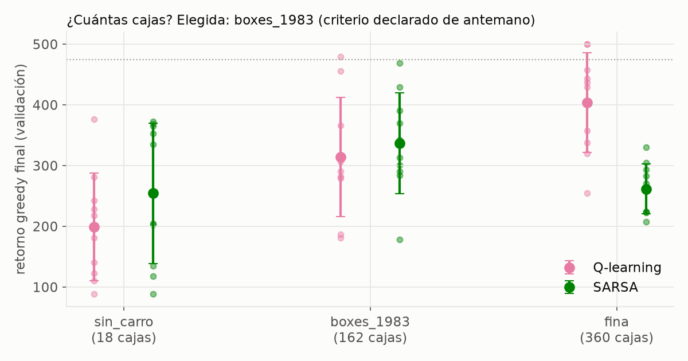
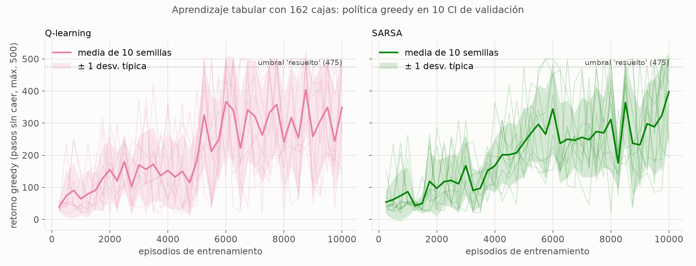
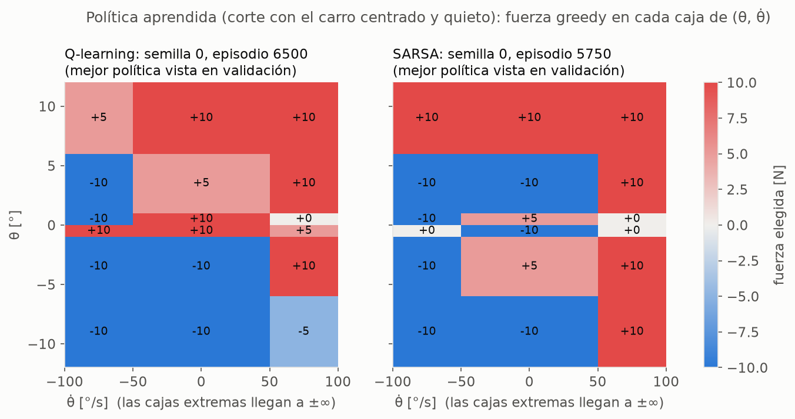

# 07–08 — Discretización y aprendizaje por refuerzo tabular (Q-learning y SARSA)

Código: [`rl/discretization.py`](../src/cartpole_lab/rl/discretization.py),
[`rl/tabular.py`](../src/cartpole_lab/rl/tabular.py),
[`rl/evaluation.py`](../src/cartpole_lab/rl/evaluation.py) (métricas de aprendizaje),
[`scripts/train_tabular.py`](../scripts/train_tabular.py). Resultados:
[`results/rl/tabular.json`](../results/rl/tabular.json) y
[`results/weights/tabular_*.json`](../results/weights/). Tests: `test_discretization.py`,
`test_tabular.py`, `test_rl_evaluation.py`.

---

## 1. De controlar a aprender

Los controladores de la Fase 1 se **diseñaron**: alguien escribió la ley de control, a
partir del modelo o de la intuición física. Un agente de aprendizaje por refuerzo parte de
cero. Solo recibe la recompensa de CartPole-v1 (+1 por cada paso sin caer) y tiene que
descubrir qué hacer probando.

Condiciones comunes a todo el RL de este proyecto:
- **Actuador:** los 5 niveles de fuerza acordados, {−10, −5, 0, 5, 10} N, sobre el mismo
  actuador continuo que la Fase 1.
- **Recompensa:** la de Gymnasium, sin modificar.

## 2. Paso 7: discretización del estado

### 2.1 Por qué hace falta

Un método tabular guarda un valor Q(s, a) por par (estado, acción). El estado continuo
tiene infinitos valores, así que se agrupa en **cajas**: cada variable se corta en
intervalos, y una caja es una combinación de intervalos.

### 2.2 Punto de partida: las 162 cajas de 1983, verificadas en el código original

Es la partición de Barto, Sutton y Anderson (1983), el artículo del que deriva el
CartPole de Gymnasium. Los umbrales se **verificaron en el código original `pole.c`**
(función `get_box`), que Gymnasium cita como fuente:

| Variable | Bordes | Intervalos | Qué distingue |
|---|---|---|---|
| x | ±0.8 m | 3 | ¿cerca de un borde del raíl? |
| ẋ | ±0.5 m/s | 3 | ¿se mueve deprisa? |
| θ | ±6°, ±1°, 0 | 6 | resolución fina cerca de la vertical |
| θ̇ | ±50°/s | 3 | ¿cae deprisa? |
| | | **3·3·6·3 = 162** | |

- **Lógica de diseño:** resolución fina donde el control necesita precisión (θ cerca de 0)
  y gruesa donde basta saber "hacia qué lado".
- **Convención de bordes:** la misma que `pole.c`. Un valor igual a un borde pertenece a la
  caja superior (`test_value_on_an_edge_goes_to_the_upper_box`).
- **Resultado histórico** registrado en el propio `pole.c`: su actor-crítico (ASE/ACE, con 2
  acciones) equilibró el poste más de 100 000 pasos tras **79 ensayos**.

### 2.3 El número de cajas se justifica midiendo

Se compararon tres discretizaciones con los mismos hiperparámetros, 2 métodos × 10 semillas
cada una y 10 000 episodios. La regla de elección se **declaró antes de ver resultados**:
mayor retorno greedy final (media de las 3 últimas evaluaciones, en las CI de validación,
promediado sobre semillas y métodos); si otra queda a menos de una desviación típica y tiene
menos cajas, gana la más pequeña.

| Discretización | Cajas | Q-learning | SARSA | Ambos (criterio) |
|---|---|---|---|---|
| sin_carro (ignora x, ẋ) | 18 | 199 ± 89 | 254 ± 116 | 227 ± 105 |
| **boxes_1983** | **162** | 314 ± 98 | **337 ± 83** | **325 ± 89** |
| fina (doble resolución en el poste) | 360 | **404 ± 82** | 262 ± 42 | 333 ± 96 |



- **Elegida: boxes_1983.** La fina es la mejor en media, pero BOXES queda a menos de una
  desviación típica con menos de la mitad de cajas.
- **Hace falta ver el carro:** sin x ni ẋ el rendimiento cae claramente, porque el agente
  no puede evitar salirse del raíl.
- **Matiz honesto:** para **Q-learning sola**, la discretización fina sería claramente mejor
  (404 frente a 314). Para SARSA es peor. La regla declarada promediaba ambos métodos y se
  respeta tal cual, pero la "mejor" discretización depende del algoritmo.

## 3. Paso 8: Q-learning y SARSA

### 3.1 Los algoritmos

Ambos corrigen su estimación con la diferencia temporal (TD):

$$
Q(s,a) \leftarrow Q(s,a) + \alpha\,\big[\text{objetivo} - Q(s,a)\big]
$$

La **única** diferencia es el objetivo (`td_target`, que tiene su propio test):

| | Objetivo | Pregunta que responde |
|---|---|---|
| **Q-learning** (off-policy) | r + γ · max_a′ Q(s′, a′) | ¿cuánto vale esto si a partir de ahora actúo de forma óptima? |
| **SARSA** (on-policy) | r + γ · Q(s′, a′), con a′ la acción que *realmente* tomará | ¿cuánto vale esto con la política que sigo, incluida su exploración? |

**Fin de episodio** (un detalle que se equivoca a menudo; Pardo et al., 2018):
- Si el poste cae, no hay futuro: el objetivo es solo r.
- Si el episodio se corta por tiempo (500 pasos), el sistema **no** ha fallado, y se sigue
  estimando el futuro.

### 3.2 Hiperparámetros y justificación

| Parámetro | Valor | Justificación |
|---|---|---|
| γ | 0.99 | horizonte efectivo 1/(1−γ) = 100 pasos = **2 s**: 8 veces la constante de tiempo con que cae el poste sin control (0.25 s) y del orden del modo lento del carro (~1 s). Además es el valor estándar |
| α | 0.1, constante | **SUPUESTO heurístico.** La teoría de convergencia (Robbins–Monro) pide un α decreciente, y aquí *no* se cumple. Con cajas, una misma caja mezcla estados distintos y las transiciones parecen aleatorias; un α moderado promedia ese ruido |
| ε | de 1.0 a 0.01, lineal, en la primera mitad (5000 episodios); luego fijo | explorar al principio es obligatorio; al final, casi siempre explotar. El calendario es una elección |
| Q inicial | 0 | "pesimista" (el valor real está entre 1 y 100); la exploración la aporta ε |
| Presupuesto | 10 000 episodios | exploración previa con 10 000 episodios: la curva sigue oscilando pasada la mitad; no hay meseta estable que justifique más |
| Empates | al azar al entrenar; hacia la fuerza más suave en la política final | con Q = 0 al inicio, un argmax ingenuo elegiría siempre −10 N |

### 3.3 Protocolo de evaluación

- **Tres conjuntos de semillas separados:**
  - entrenamiento (0–9);
  - **validación** (2000–2009), para las curvas y para elegir;
  - **test** (1000–1049), el protocolo de sanity común a todos los métodos.
- **Dos políticas por semilla, evaluadas en test:** la tabla al terminar, y la **mejor vista
  en validación** (parada temprana).
- **"Episodios para aprender":** el umbral oficial de CartPole-v1 es 475. Se usan dos
  definiciones:
  - greedy: primera evaluación con media ≥ 475;
  - clásica: media móvil de 100 episodios de entrenamiento ≥ 475.

## 4. Resultados (N = 10 semillas, 162 cajas)

### 4.1 Curvas de aprendizaje



| | Q-learning | SARSA |
|---|---|---|
| Semillas que alcanzan 475 (greedy) | **10/10**; mediana de 6000 episodios (5250–9250) | 9/10; mediana de 7500 (5000–9500) |
| Semillas que alcanzan 475 (clásica) | 10/10; mediana de 5812 | 7/10; mediana de 7691 |
| Retorno greedy final (validación) | 314 ± 98 | 337 ± 83 |

Lectura:
1. **Aprenden, pero muy despacio comparado con 1983:** ~6000 episodios frente a los 79
   ensayos del actor-crítico original. No es una comparación limpia (otro algoritmo, 2
   acciones frente a 5), pero da escala.
2. **El salto hacia el episodio 5000** coincide con el momento en que ε llega a su mínimo.
   Con agregación en cajas, lo que se aprende depende de qué estados se visitan. Mientras
   ε es alto, las visitas son las de una política casi aleatoria.
3. **Las curvas no convergen: oscilan.** Una semilla pasa de 500 a menos de 150 en pocos
   cientos de episodios. Es un fenómeno conocido: con agregación de estados, Q-learning y
   SARSA no tienen garantía de convergencia a una política estable, y la política "tirita"
   (Gordon, 2001). **Alcanzar 475 en un punto de evaluación es fácil** (hasta con 18 cajas
   lo logran 10/10 semillas); **mantenerse no**.

### 4.2 En test: política final frente a mejor política guardada

| | Q-learning final | **Q-learning mejor** | SARSA final | SARSA mejor |
|---|---|---|---|---|
| Supervivencia 500 pasos | 49 % ± 43 % | **93 % ± 6 %** | 56 % ± 47 % | 78 % ± 28 % |
| Estabilizado (< 0.5°, < 5 cm) | 0 % | **0 %** | 0 % | 0 % |
| Esfuerzo Σ\|F\|τ | 48 ± 24 N·s | **71 ± 10 N·s** | 51 ± 19 N·s | 66 ± 15 N·s |
| Tiempo en el límite de ±10 N | 43 % | 52 % | 48 % | 53 % |

- **La tabla final es poco fiable** (supervivencia 49 % ± 43 %, con una variabilidad
  enorme entre semillas). **Guardar la mejor en validación** la sube a 93 %.
- **Sesgo optimista de la selección, visible y reportado:** esas mejores políticas daban
  500/500 en validación y en test bajan a 93 % (Q) y 78 % (SARSA). Se eligió el máximo entre
  40 evaluaciones de solo 10 episodios.
- **Calidad de control muy inferior a la Fase 1.** Nunca se estabiliza según el criterio
  clásico, y el esfuerzo es **~60 veces el del PID** (1.1 N·s) y ~200 veces el del LQR, con
  la fuerza al máximo la mitad del tiempo. **No es un fallo del algoritmo, es lo que pide
  la recompensa:** +1 por paso vivo no premia centrar el carro ni ahorrar fuerza. Es la
  advertencia de la doc 01 §7.1, "lo que optimizas es lo que obtienes", ahora con números.

### 4.3 ¿Qué ha aprendido? (política en el plano θ, θ̇)



El corte mostrado (carro centrado y quieto) cubre el 68 % del tiempo en test de Q-learning
y el 49 % del de SARSA.

- **Q-learning aprendió reglas físicamente coherentes.** En las cajas con el poste inclinado
  1–6° y velocidad moderada, empuja hacia el lado de la inclinación el **100 %** del tiempo
  que pasa en ellas. Se parece a la tabla de reglas del fuzzy (doc 06).
- **SARSA encontró otra estrategia.** En esas mismas cajas empuja hacia el lado de la
  inclinación solo el **48 %** del tiempo; a menudo empuja *al revés*. Aun así sobrevive:
  empujar al revés acelera la caída, θ̇ supera los 50°/s, entra en la caja de caída rápida,
  y ahí empuja a fondo en la dirección correcta. **Explota la geometría de las cajas.** Es
  una estrategia más frágil, coherente con su peor resultado en test.
- **Cajas raras, Q sin aprender:** las cajas que una buena política evita (p. ej. caída muy
  rápida con el carro centrado) apenas se visitan, y su Q queda casi en 0. El agente no sabe
  qué hacer en situaciones que ha aprendido a evitar. Esto limita su robustez ante
  perturbaciones, lo que se medirá en la Fase 3.

## 5. Mensaje para la charla

1. **El RL tabular aprende sin modelo y sin ecuaciones**, y redescubre reglas parecidas a
   las que escribiría un experto. Q-learning casi reproduce la tabla del fuzzy.
2. **Pero con cajas no hay estabilidad**, y hay que guardar la mejor política vista.
3. **Tarda ~6000 episodios** (unos 5 millones de pasos simulados, horas de "experiencia"
   real) en algo que el LQR resuelve en milisegundos a partir del modelo.
4. **Hace lo que pide la recompensa, no lo que queremos:** sobrevive, pero con un control
   bang-bang caro y sin centrar el carro.
5. Todo esto motiva el siguiente paso: **aproximar Q con una red neuronal (DQN)** en lugar de
   cajas, para no perder información del estado continuo.

## 6. Supuestos sin base teórica (explícitos)

1. **α constante = 0.1** (no cumple Robbins–Monro), calendario lineal de ε y Q inicial 0.
2. **5 niveles de fuerza** (acordado). Con 2 niveles, el problema sería el CartPole canónico.
3. **Criterio de selección de la discretización:** promediado sobre ambos métodos, con la
   tolerancia de una desviación típica del mejor (§2.3; `select_by_parsimony`).
4. **Presupuesto de 10 000 episodios**, justificado por la ausencia de meseta estable, no
   por un criterio formal.
5. **10 episodios de validación** por evaluación: es la causa del sesgo optimista de la
   mejor política (§4.2).

## 7. Reproducir

```bash
python scripts/train_tabular.py                          # ~16 min con 12 procesos
python scripts/train_tabular.py --regenerate-artifacts   # ~2 min: reentrena SOLO las semillas elegidas,
                                                         # comprueba que reproduce el registro EXACTAMENTE
                                                         # y regenera pesos y mapa de política
python -m pytest tests/test_discretization.py tests/test_tabular.py tests/test_rl_evaluation.py
```

**Corrección durante este paso:** la primera ejecución exportó en `results/weights/` la tabla
*final* en lugar de la *mejor* política guardada, por una edición del script que no se
aplicó. Se corrigió y los pesos se regeneraron con `--regenerate-artifacts`. Las semillas
seleccionadas se reprodujeron exactamente, lo que confirma a la vez que el resultado es
reproducible. Las cifras de test del registro no se vieron afectadas: ya evaluaban ambas
tablas.
