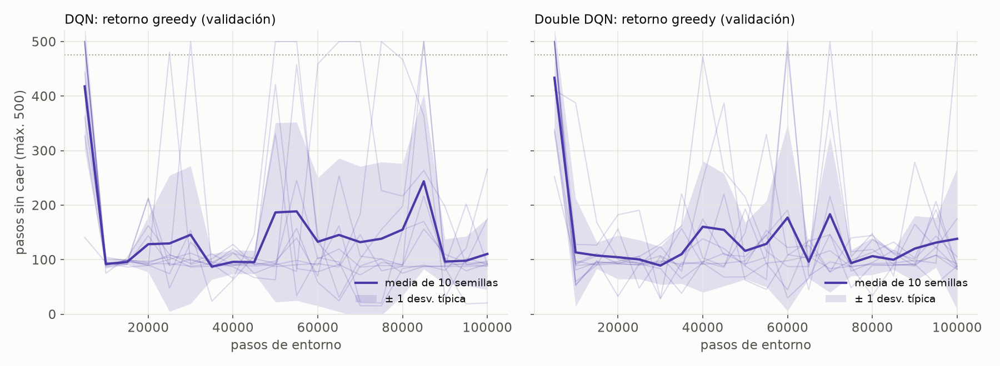
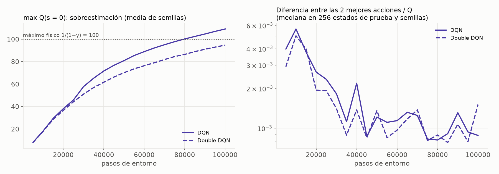
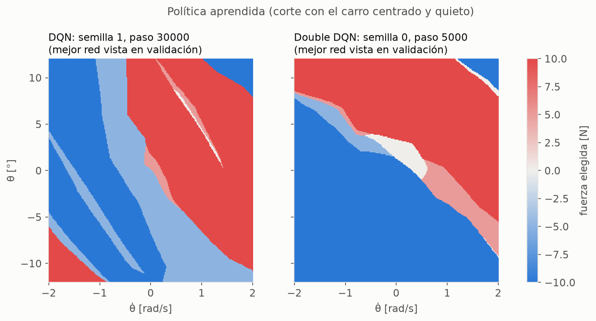

# 09 — Deep Q-Network (DQN) y Double DQN

Código: [`rl/dqn.py`](../src/cartpole_lab/rl/dqn.py), [`rl/replay.py`](../src/cartpole_lab/rl/replay.py),
[`scripts/train_dqn.py`](../scripts/train_dqn.py). Resultados:
[`results/rl/dqn.json`](../results/rl/dqn.json). Pesos para el navegador:
[`results/weights/dqn.json`](../results/weights/dqn.json) y
[`results/weights/double_dqn.json`](../results/weights/double_dqn.json). Tests: [`tests/test_dqn.py`](../tests/test_dqn.py).

---

## 1. De la tabla a la red

La tabla del paso 8 agrupa estados distintos en la misma caja: pierde información, el
aprendizaje oscila y hay cajas que nunca se aprenden. Un DQN sustituye la tabla por una
**red neuronal** Q_φ(s, ·). La red recibe el estado continuo, devuelve un valor por cada
acción e interpola entre estados parecidos. La actualización es la de Q-learning,
convertida en regresión:

$$
\mathcal{L} = \text{Huber}\Big(Q_\phi(s,a),\; r + \gamma\,(1-\text{terminado})\,\max_{a'} Q_{\phi^-}(s',a')\Big)
$$

Dos piezas la hacen viable (Mnih et al., 2015):
- **Memoria de repetición** (50 000 transiciones): se entrena con lotes al azar, no con la
  secuencia correlacionada del episodio en curso.
- **Red objetivo** Q_φ⁻: una copia congelada, sincronizada cada 500 pasos, para que el
  objetivo no se mueva con cada actualización.

## 2. Diseño e hiperparámetros

| Elemento | Valor | Justificación |
|---|---|---|
| Red | 4 → 64 → 64 → 5, ReLU (4 869 parámetros) | **heurístico**: dos capas bastan para funciones suaves de 4 variables; pequeña para el navegador |
| Entradas | x/2.4 m, ẋ/1.0 m/s, θ/12°, θ̇/1.5 rad/s | posiciones: límites de fallo (base física). Velocidades: orden de magnitud *medido* (p99 con política aleatoria: 1.2 m/s y 1.7 rad/s) |
| Acciones, recompensa, γ | 5 niveles de fuerza, +1 por paso, γ = 0.99 | idénticos al paso 8, para comparar métodos |
| Pérdida | Huber | como en Mnih et al. (2015): acota el gradiente de errores grandes |
| Optimizador | Adam, lr = 10⁻³, lote de 64, recorte del gradiente a norma 10 | **heurístico**: lr = valor por defecto de Adam |
| Memoria / inicio | 50 000 transiciones / aprender desde 1 000 | **heurístico**: ~100 episodios buenos; los primeros lotes no deben ser casi idénticos |
| Red objetivo | copia cada 500 pasos (un episodio completo) | **heurístico** |
| Exploración | ε de 1.0 a 0.05, lineal, en el primer 20 % | **heurístico** |
| Fin de episodio | solo el fallo real anula el bootstrap; el truncamiento no | igual que en el paso 8 |
| Presupuesto | 100 000 pasos de entorno | se mide en experiencia, no en episodios |
| Reproducibilidad | CPU, 1 hilo, `torch.use_deterministic_algorithms(True)`, semillas en NumPy, PyTorch y el entorno | la repetición completa del experimento reprodujo **exactamente** los 20 entrenamientos |

**Lo que se evalúa es lo que se exporta:** durante el entrenamiento, la política se
evalúa con la misma pasada hacia delante en NumPy que se exporta a JSON
(`network_forward_numpy`). Un test comprueba que coincide con PyTorch (tolerancia 10⁻⁵).

## 3. Diagnóstico y experimento declarado

Una exploración previa con dos semillas mostró algo alarmante: la red estimaba
**Q(s = 0) ≈ 109**. Eso es imposible. Con +1 por paso y γ = 0.99, el máximo alcanzable es
1/(1−γ) = **100** (`q_upper_bound`). Es la **sobreestimación** clásica de DQN: el `max` de
estimaciones ruidosas está sesgado al alza, porque el ruido positivo siempre "gana".

El remedio estándar es **Double DQN** (van Hasselt, Guez y Silver, 2016): la red online
elige la acción siguiente y la red objetivo la evalúa. Es un cambio de una línea en
`dqn_targets`, y tiene su propio test. **El experimento se declaró antes de verlo:** DQN y
Double DQN con hiperparámetros idénticos, 10 semillas cada uno, ambos reportados.

## 4. Resultados (10 semillas por variante)

### 4.1 Curvas de aprendizaje



| | DQN | Double DQN |
|---|---|---|
| Semillas con alguna evaluación greedy ≥ 475 | 8/10, **5 de ellas ya a los 5 000 pasos** (~170 episodios) | 7/10, 6 de ellas a los 5 000 pasos |
| Retorno greedy al final (validación) | **102 ± 33** | 130 ± 46 |
| Media móvil de entrenamiento ≥ 475 | **0/10** | **0/10** |

**No converge: aprende pronto y después olvida.**
- En la primera evaluación, a los 5 000 pasos, la mayoría de semillas ya tiene una política
  que aguanta 500 pasos. En episodios, es unas 35 veces menos experiencia que el tabular
  (~6 000).
- **Después el rendimiento se hunde** y oscila en torno a 100 pasos durante el resto del
  entrenamiento, con picos esporádicos.
- Ninguna semilla mantiene 475 de media en entrenamiento.

### 4.2 ¿Por qué? Dos diagnósticos medidos



| | DQN | Double DQN |
|---|---|---|
| max Q(s = 0) al final | **109 ± 10**, por encima de la cota física en 9/10 semillas | **95 ± 4**, por encima en 1/10 |
| Diferencia entre las dos mejores acciones / Q, primera evaluación | 0.40 % | 0.35 % |
| Ídem, última evaluación | **0.12 %** | 0.13 % |

1. **Double DQN corrige la sobreestimación respecto a la cota física, pero no el colapso.**
   El diagnóstico inicial era real, pero no era la causa principal del hundimiento. Matiz:
   la política final aguanta ~100 pasos, y el valor *real* de esa política es
   Σ_{k<100} 0.99^k ≈ 63. **Respecto a su propia política, ambas variantes sobreestiman**;
   Double DQN, menos.
2. **La diferencia entre acciones se desvanece.** Con recompensa constante, todos los
   valores Q tienden al mismo número. La política depende solo de la diferencia entre la
   mejor acción y la segunda, que cae a ~0.1 % del valor (unas 0.1 unidades con Q ≈ 100).
   Con diferencias tan pequeñas, el error de aproximación de la red basta para cambiar la
   acción elegida. Es el problema conocido de la "action gap" pequeña.
3. **Hipótesis compatible, no demostrada aquí:** cuando la política es buena, la memoria se
   llena de transiciones de supervivencia, y los fallos (la única señal informativa, porque
   la recompensa es constante) escasean. La red "olvida" dónde está el peligro, falla, la
   memoria vuelve a llenarse de fallos, y el ciclo se repite. Los datos son coherentes
   con ello, pero no se ha medido la composición de la memoria.

**Implicación pedagógica:** una política buena no requiere valores Q correctos. A los
5 000 pasos, Q(s = 0) ≈ 8, muy lejos de su valor real, y sin embargo la política ya es
buena: solo importa el *orden* de las acciones.

### 4.3 En test: red final frente a mejor red guardada

| | DQN final | **DQN mejor** | Double final | Double mejor |
|---|---|---|---|---|
| Supervivencia 500 pasos | **0 %** | **79 % ± 42 %** | 9 % ± 28 % | 76 % ± 39 % |
| Estabilizado (< 0.5°, < 5 cm) | 0 % | 0.4 % | 0 % | 0 % |
| Esfuerzo Σ\|F\|τ | 12 N·s | 54 ± 21 N·s | 19 N·s | 58 ± 25 N·s |
| Motivo principal de fallo | carro fuera del raíl | carro fuera del raíl | carro fuera del raíl | carro fuera del raíl |

- **Sin parada temprana, el DQN no sirve:** las redes finales fallan en todos los episodios
  de test.
- **Con parada temprana funciona en ~3 de cada 4 casos,** pero con una variabilidad enorme
  entre semillas (± 40 %): algunas semillas sobreviven siempre y otras nunca.
- **Cuando falla, casi siempre es porque el carro se sale:** equilibra el poste, pero
  deriva. La recompensa no pide centrar el carro, y la consecuencia de derivar llega
  segundos después.

### 4.4 Las redes exportadas (para el navegador)

La política aprendida, con el carro centrado y quieto:



| Red exportada | Seleccionada por | Test: supervivencia | Tiempo en ±10 N | Esfuerzo |
|---|---|---|---|---|
| DQN, semilla 1, paso 30 000 | validación (500/500) | **96 %** | 4 % | 51 N·s |
| Double DQN, semilla 0, paso 5 000 | validación (500/500) | **100 %** | 90 % | 95 N·s |

- La red de **Double DQN** (paso 5 000) es una política limpia: una **recta de conmutación
  diagonal**. Empuja a la izquierda si θ + k·θ̇ < 0 y a la derecha si es > 0. Es la forma de
  un PD con saturación, redescubierta sin modelo. La aplica casi siempre a fondo, ±10 N.
- La de **DQN** (paso 30 000) es más irregular, con franjas y regiones de esquina
  físicamente dudosas, pero usa sobre todo ±5 N.
- Ambas se eligieron con semillas de **validación**; el test (semillas 1000–1049) no
  intervino en la elección.

## 5. Mensaje para la charla

1. **Una red aprende mucho más rápido que una tabla:** en ~170 episodios tiene una política
   que aguanta 500 pasos, frente a ~6 000 del tabular.
2. **Pero no converge:** el rendimiento se hunde y oscila. Sin guardar la mejor red, el
   resultado final es inservible.
3. **Diagnosticar antes de "arreglar":** la sobreestimación era real y Double DQN la
   corrige, pero no era la causa del colapso. La recompensa constante hace que la diferencia
   entre acciones sea diminuta.
4. **Lo que optimizas es lo que obtienes,** otra vez: equilibra el poste, pero deja derivar
   el carro y gasta ~50 veces el esfuerzo del PID.

## 6. Qué NO se ha hecho (y podría hacerse)

Estabilizar el DQN es posible con técnicas conocidas, pero cada una es un ajuste adicional
que habría que justificar y declarar, y no se ha hecho para no "forzar un resultado":
- actualización suave de la red objetivo (Polyak);
- tasa de aprendizaje menor o decreciente;
- memoria mayor o *prioritized replay*;
- más pasos;
- cambiar la recompensa. Esto último cambiaría la tarea, y en la Fase 1 se acordó no hacerlo.

## 7. Supuestos sin base teórica (explícitos)

1. **Arquitectura 64×64**, lr, lote, tamaño de la memoria, sincronización cada 500 pasos y
   calendario de ε: valores heurísticos habituales, **no ajustados** a este problema.
2. **Escalas de velocidad** para normalizar (1.0 m/s y 1.5 rad/s): órdenes de magnitud medidos.
3. **Presupuesto de 100 000 pasos.**
4. **Evaluación cada 5 000 pasos con 10 episodios:** la mejor red se elige entre 20 puntos
   de control, y eso introduce un sesgo optimista (validación 500 frente a test 76–79 %).
5. **256 estados de prueba** para medir la diferencia entre acciones, en la caja
   ±(0.5 m, 0.5 m/s, 0.1 rad, 0.5 rad/s).

## 8. Reproducir

```bash
python scripts/train_dqn.py                          # ~8 min con 12 procesos: 2 variantes × 10 semillas
python scripts/train_dqn.py --regenerate-artifacts   # reentrena solo las redes exportadas y verifica
python -m pytest tests/test_dqn.py
```
