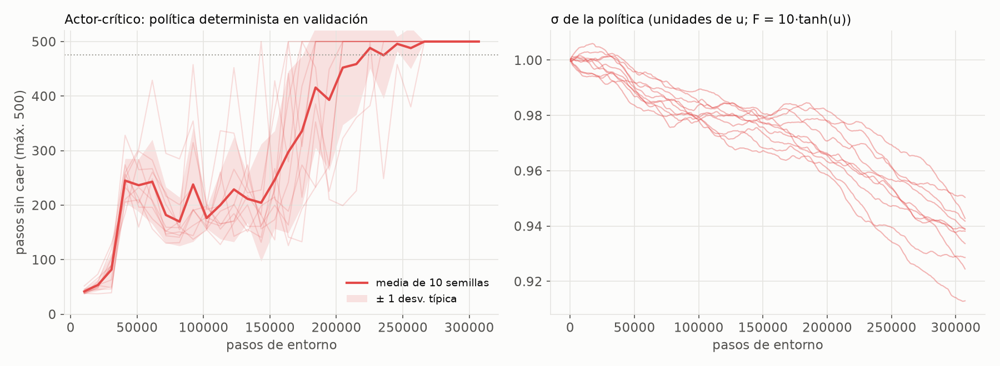
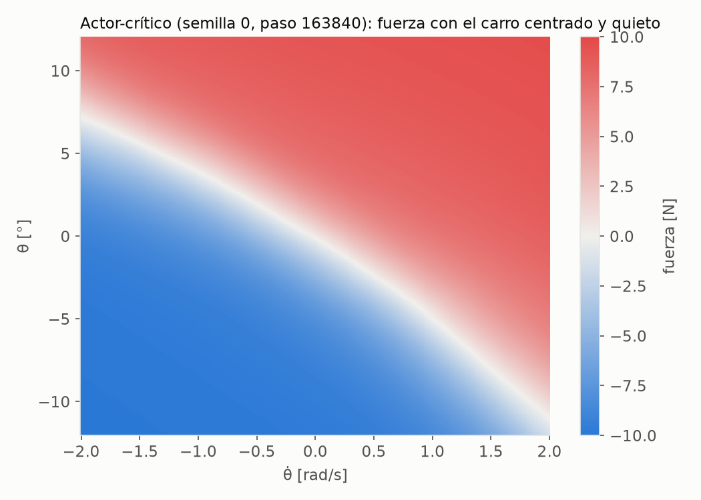
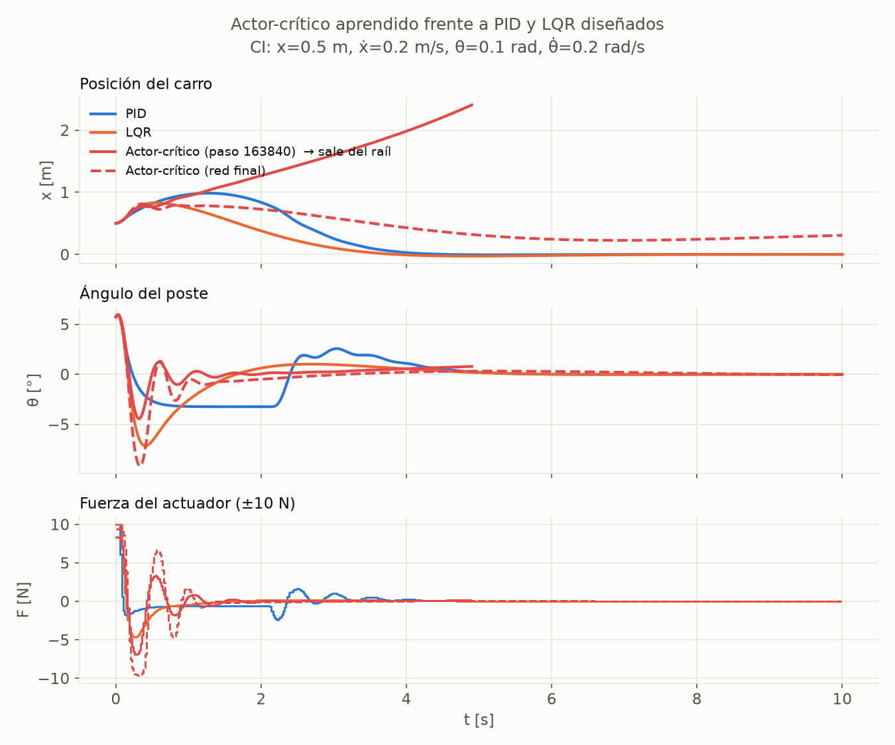

# 10 — Actor-crítico (A2C con ventaja GAE y acción continua)

Código: [`rl/actor_critic.py`](../src/cartpole_lab/rl/actor_critic.py),
[`scripts/train_actor_critic.py`](../scripts/train_actor_critic.py),
[`scripts/rl_boundary_checks.py`](../scripts/rl_boundary_checks.py). Resultados:
[`results/rl/actor_critic.json`](../results/rl/actor_critic.json),
[`results/rl/boundary_checks.json`](../results/rl/boundary_checks.json). Pesos:
[`results/weights/actor_critic.json`](../results/weights/actor_critic.json) y
[`actor_critic_final.json`](../results/weights/actor_critic_final.json). Tests:
[`tests/test_actor_critic.py`](../tests/test_actor_critic.py).

---

## 1. Idea: dos redes con papeles distintos

- **Actor π_θ(F | s):** la política. Aquí es **continua**, como acordamos en la Fase 1:
  elige cualquier fuerza en (−10, 10) N, igual que el LQR.
- **Crítico V_w(s):** estima cuánto vale estar en s (el retorno esperado).

El crítico juzga al actor mediante la **ventaja**: "¿esta acción salió mejor o peor de lo
que esperaba el crítico?". El actor aumenta la probabilidad de las acciones con ventaja
positiva:

$$
\mathcal{L}_{\text{actor}} = -\,\mathbb{E}\big[\log \pi_\theta(F_t\mid s_t)\,\hat A_t\big] - c_H\,\mathcal{H},
\qquad
\mathcal{L}_{\text{crítico}} = \tfrac12\,\mathbb{E}\big[(V_w(s_t) - \hat R_t)^2\big]
$$

Es A2C (Mnih et al., 2016), la versión síncrona del actor-crítico con ventaja: 8 entornos
en paralelo × 32 pasos = 256 transiciones por actualización.

## 2. La función de ventaja: GAE(λ)

A partir del error TD δ_t = r_t + γ V(s_{t+1}) − V(s_t):

$$
\hat A_t = \delta_t + \gamma\lambda\,\delta_{t+1} + (\gamma\lambda)^2\,\delta_{t+2} + \dots
\qquad(\text{cortada al acabar el episodio})
$$

- **λ = 0:** ventaja TD de un paso (poca varianza, más sesgo).
- **λ = 1:** retorno Monte Carlo menos V (sin sesgo, mucha varianza).
- **Se usa λ = 0.95,** el compromiso estándar (Schulman et al., 2016).

Un test comprueba que con λ = 1 GAE da exactamente el retorno descontado menos V.

**Fin de episodio con varios entornos a la vez** (el detalle delicado, con su propio test):
- **Fallo:** el futuro vale 0.
- **Truncamiento por tiempo:** se estima con V del último estado *real*, guardado *antes*
  del reset. Si no, se usaría V del primer estado del episodio siguiente.
- **La suma de GAE no cruza de un episodio a otro** (`test_gae_does_not_leak_across_episode_boundaries`).

## 3. Acción continua sin sesgo: tanh en lugar de recorte

Si se muestrea F ~ N(μ, σ) y el actuador la recorta a ±10 N, el log π del gradiente es el
de la fuerza *sin* recortar: el gradiente queda sesgado. Por eso u ~ N(μ(s), σ²) y
F = 10·tanh(u). Así **toda muestra es admisible** (el actuador nunca recorta), y la
densidad se corrige exactamente con el jacobiano del cambio de variable, como en SAC
(Haarnoja et al., 2018):

$$
\log \pi(F\mid s) = \log \mathcal N(u;\mu,\sigma) - \log\!\big(F_{\max}(1-\tanh^2 u)\big)
$$

Se implementa con la forma numéricamente estable
log(1 − tanh² u) = 2(log 2 − u − softplus(−2u)). Hay test contra la fórmula directa y para
|u| = 30. **Al evaluar se usa la política determinista** F = 10·tanh(μ(s)), y eso es lo que
se exporta.

## 4. Hiperparámetros

| Parámetro | Valor | Justificación |
|---|---|---|
| Redes | actor 4 → 64 → 64 → μ; crítico 4 → 64 → 64 → V; ReLU; **separadas** | aprenden cosas distintas y no se estorban. **Heurístico** |
| σ | parámetro libre log σ, independiente del estado; σ₀ = 1 en unidades de u | forma estándar en A2C y PPO continuos |
| Última capa del actor | pesos ×0.01 | μ ≈ 0 al empezar, así solo σ explora. **Heurístico** estándar |
| γ, λ | 0.99, 0.95 | γ igual que el resto de RL; λ, valor estándar de GAE |
| Optimizadores | Adam: actor 3·10⁻⁴, crítico 10⁻³; recorte del gradiente a 0.5 | **heurísticos** habituales (Andrychowicz et al., 2021) |
| Entropía | c_H = 10⁻³ | evita que σ colapse antes de tiempo. **Heurístico** |
| Ventajas | normalizadas por lote | reduce la varianza del gradiente. **Heurístico** |
| Entradas | mismas escalas que el DQN | comparabilidad |
| Presupuesto | 307 200 pasos (1 200 actualizaciones) | exploración previa: la curva se estabiliza hacia los 200 000 pasos |

## 5. Resultados (10 semillas)

### 5.1 Aprendizaje: por fin converge



| | Actor-crítico | DQN | Q-learning tabular |
|---|---|---|---|
| Validación al final | **500 ± 0**, en **10/10** semillas | 102 ± 33 | 314 ± 98 |
| Semillas perfectas en todo el último tercio | **8/10** | — | — |
| Pasos hasta la primera evaluación ≥ 475 | 143 000–236 000 (media ~183 000) | ~5 000, pero no se mantiene | — |
| Media móvil de entrenamiento ≥ 475 (criterio clásico) | **10/10**, a los ~2 000–2 470 episodios | 0/10 | 10/10, ~5 800 |

- **El actor-crítico es el único método de RL del proyecto que converge y se mantiene.**
- Aprende más despacio que el DQN (unas 35 veces más pasos hasta la primera política
  buena), pero **no olvida**.
- σ baja lentamente, de 1.0 a 0.93: la exploración nunca colapsa, y aun así la media de la
  política se estabiliza.
- La varianza explicada del crítico oscila, y es a veces negativa. Cuando casi todos los
  episodios llegan a 500 pasos, los retornos apenas varían y el cociente se vuelve
  inestable. Es una limitación de ese diagnóstico, no un fallo del aprendizaje.

### 5.2 En test (CI de la distribución oficial, semillas 1000–1049)

| | Red final | Red "mejor" (regla común) |
|---|---|---|
| Supervivencia 500 pasos | **100 %** (500/500 episodios) | 100 % |
| Tiempo en el límite de ±10 N | **0 %** | 0 % |
| Esfuerzo Σ\|F\|τ | **0.87 ± 0.38 N·s** | 0.87 ± 0.47 N·s |
| max \|θ\| en el último segundo | 0.08° | 0.40° |
| max \|x\| en el último segundo | **0.45 ± 0.25 m** | 1.19 ± 0.65 m |
| "Estabilizado" (< 0.5° y < 5 cm) | 0 % | 0.2 % |

- **Controla el poste con precisión y sin forzar el actuador.** Su esfuerzo es del orden
  de los controladores clásicos (PID 1.11 N·s, fuzzy 0.87, LQR 0.33 N·s), y unas 80 veces
  menor que el del RL tabular.
- **Pero deja el carro donde caiga,** a medio metro del centro de media. Nunca cuenta como
  "estabilizado". Otra vez, la recompensa no pide centrar el carro.
- **Matiz de la regla de exportación.** La regla común (pasos 8 y 9) toma "la mejor red en
  validación, la primera ante empates". Como aquí casi todas las evaluaciones valen 500,
  elige la red **más temprana**, que deja el carro más lejos (1.19 m frente a 0.45 m). Se
  mantiene la regla por coherencia, y **se exporta también la red final**
  (`actor_critic_final.json`), que es la recomendable para el navegador.

### 5.3 ¿Qué ha aprendido?



Una **frontera diagonal suave**: empuja a la derecha si θ + k·θ̇ > 0, con una transición
gradual. Es un **PD saturado por tanh**, aprendido sin modelo y sin reglas. Es la misma
forma que el fuzzy (doc 06) y que la recta de conmutación del Double DQN (doc 09), pero
continua en lugar de a saltos.

### 5.4 Fuera de la distribución de entrenamiento



Desde el **estado difícil de referencia**, la red "mejor" equilibra el poste pero deja
escapar el carro, que se sale a los ~4.9 s. La red final sobrevive, pero deja el carro a
unos 0.3 m. Para no quedarse con un solo caso, se aplicó a **todas** las políticas de RL
exportadas la misma prueba que a los controladores de la Fase 1
(`scripts/rl_boundary_checks.py`):

| Política | Estado de referencia | 12 estados cerca de la frontera: sobrevive | … estabiliza |
|---|---|---|---|
| Q-learning tabular | carro fuera | 1 | 0 |
| SARSA tabular | cae el poste | 1 | 0 |
| DQN | carro fuera | 0 | 0 |
| Double DQN | sobrevive | **6** | 0 |
| Actor-crítico ("mejor") | carro fuera | 1 | 0 |
| Actor-crítico (final) | sobrevive | 3 | 0 |
| *Fase 1: MPC / PID / fuzzy / LQR* | *estabilizan* | — | *12 / 8 / 7 / 6* |

Todas las políticas fallan de forma **explícita** en los dos estados irrecuperables.

**Ninguna política de RL estabiliza un solo estado de la frontera; todos los controladores
diseñados estabilizan al menos la mitad.** Los agentes se entrenaron con condiciones
iniciales cerca del centro (±0.05, la distribución oficial de CartPole-v1) y generalizan
mal fuera de lo que han experimentado: es un **cambio de distribución**. Un controlador
diseñado con un modelo no tiene ese problema. Estos 12 estados no son una muestra
representativa, sino los difíciles; el mapa sistemático queda para la Fase 3.

## 6. Mensaje para la charla

1. **El actor-crítico con acción continua es el RL que mejor funciona:** converge en todas
   las semillas, no olvida y gasta tan poco esfuerzo como un controlador clásico.
2. **Redescubre un PD saturado**, igual que el fuzzy, pero aprendido en lugar de escrito.
3. **Pero solo sabe lo que ha vivido.** Con el carro desplazado o el poste muy inclinado
   (estados que nunca vio al entrenar) falla donde el LQR o el MPC no fallan.
4. **Y hace lo que pide la recompensa,** no lo que queremos: el poste vertical sí, el carro
   centrado no.

## 7. Supuestos sin base teórica (explícitos)

1. Arquitecturas, tasas de aprendizaje, coeficiente de entropía, recorte del gradiente,
   inicialización ×0.01 y normalización de ventajas: valores **heurísticos habituales, no
   ajustados** a este problema.
2. **8 entornos × 32 pasos** por actualización.
3. **Presupuesto de 307 200 pasos**, elegido tras una exploración con dos semillas.
4. **Entropía:** se usa la de la gaussiana de u, no la de F. Es la aproximación estándar;
   la entropía exacta tras tanh no tiene forma cerrada.
5. **Distribución de entrenamiento:** la oficial de CartPole-v1 (±0.05). Entrenar con
   condiciones iniciales más variadas probablemente mejoraría la generalización (§5.4),
   pero cambiaría el protocolo común a todos los métodos de RL.

## 8. Reproducir

```bash
python scripts/train_actor_critic.py      # ~1 min con 10 procesos
python scripts/rl_boundary_checks.py      # segundos: todas las políticas de RL exportadas
python -m pytest tests/test_actor_critic.py
```

La repetición completa del experimento reprodujo exactamente la primera ejecución (curvas
de validación y σ de las 10 semillas).
