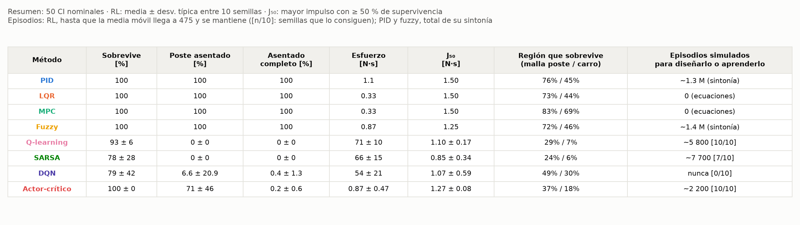
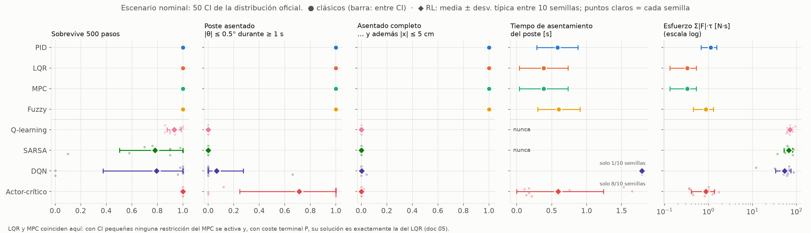
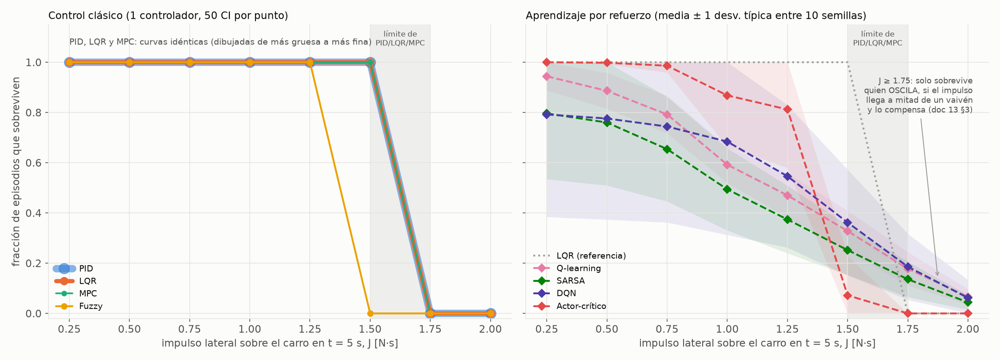
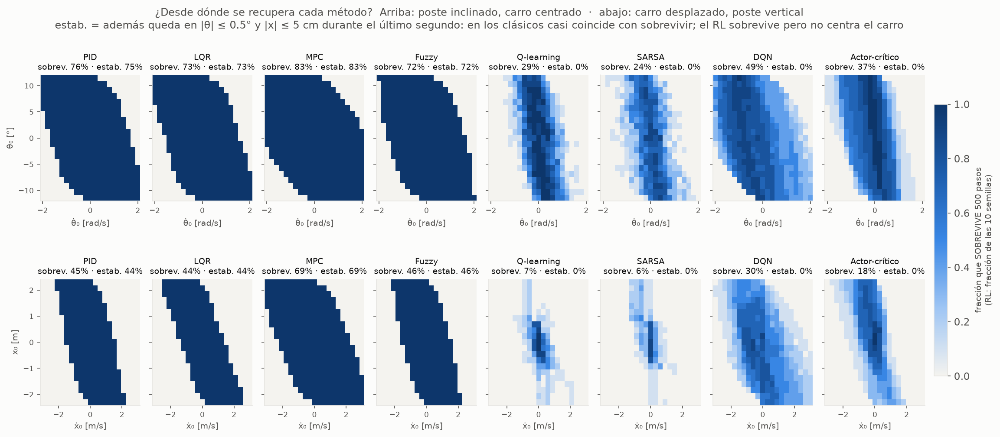
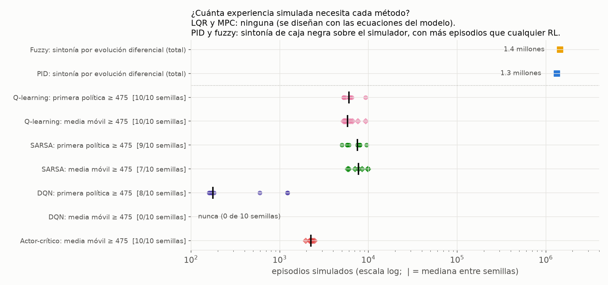

# 13 — Resultados de la evaluación comparativa (pasos 12 y 13)

La evaluación sigue el protocolo pre-registrado en [docs/12](12_protocolo_evaluacion.md),
con sus dos enmiendas y dos aclaraciones (§8 de ese documento). Datos:
[`results/metrics/comparison.json`](../results/metrics/comparison.json). Compara **8 métodos**
(4 clásicos deterministas y 4 de RL, estos con 10 semillas cada uno) en **1728 tareas**:
- 50 CI nominales;
- 8 impulsos × 50 CI;
- 2 mallas de 21 × 21 estados iniciales.

Todo corre sobre el mismo simulador, con el mismo actuador continuo de ±10 N y el mismo bucle.

**Cómo leer los "±":** en los clásicos (un solo controlador) es la dispersión **entre condiciones
iniciales**, N = 50. En el RL es la dispersión **entre las 10 semillas** de entrenamiento (cada
semilla, promediada antes sobre sus 50 CI). No son la misma cantidad: la del RL mide lo que
varía el *aprendizaje*.

## 1. Resumen



| Método | Sobrevive [%] | Poste asentado [%] | Asentado completo [%] | Esfuerzo [N·s] | J₅₀ [N·s] | Región que sobrevive (malla poste / carro) | Episodios simulados para diseñarlo o aprenderlo |
|---|---|---|---|---|---|---|---|
| PID | 100 | 100 | 100 | 1.1 | 1.50 | 76% / 45% | ~1.3 M (sintonía) |
| LQR | 100 | 100 | 100 | 0.33 | 1.50 | 73% / 44% | 0 (ecuaciones) |
| MPC | 100 | 100 | 100 | 0.33 | 1.50 | 83% / 69% | 0 (ecuaciones) |
| Fuzzy | 100 | 100 | 100 | 0.87 | 1.25 | 72% / 46% | ~1.4 M (sintonía) |
| Q-learning | 93 ± 6 | 0 ± 0 | 0 ± 0 | 71 ± 10 | 1.10 ± 0.17 | 29% / 7% | ~5 800 [10/10] |
| SARSA | 78 ± 28 | 0 ± 0 | 0 ± 0 | 66 ± 15 | 0.85 ± 0.34 | 24% / 6% | ~7 700 [7/10] |
| DQN | 79 ± 42 | 6.6 ± 20.9 | 0.4 ± 1.3 | 54 ± 21 | 1.07 ± 0.59 | 49% / 30% | nunca [0/10] |
| Actor-crítico | 100 ± 0 | 71 ± 46 | 0.2 ± 0.6 | 0.87 ± 0.47 | 1.27 ± 0.08 | 37% / 18% | ~2 200 [10/10] |

(Generada por `scripts/make_figures.py` en
[`results/metrics/summary_table.md`](../results/metrics/summary_table.md).)

- **Poste asentado:** |θ| ≤ 0.5° durante al menos el último segundo.
- **Asentado completo:** además |x| ≤ 5 cm.
- **J₅₀:** el mayor impulso del barrido con ≥ 50 % de supervivencia; su resolución es de
  0.25 N·s.
- **Episodios simulados:** en el RL, hasta que la media móvil de 100 episodios llega a 475 y
  se mantiene; [n/10] son las semillas que lo consiguen. En el PID y el fuzzy, el total de su
  sintonización por evolución diferencial (§5).

## 2. Escenario nominal



**Clásicos.** Los cuatro sobreviven y se asientan en el 100 % de las 50 CI:

| Métrica | PID | LQR | MPC | Fuzzy |
|---|---|---|---|---|
| Asentamiento del poste | 0.58 ± 0.29 s | 0.39 ± 0.35 s | igual que el LQR | 0.60 ± 0.30 s |
| Asentamiento completo | 0.65 ± 0.35 s | 0.78 ± 0.77 s | igual que el LQR | 0.66 ± 0.36 s |
| Esfuerzo | 1.11 ± 0.43 N·s | 0.33 ± 0.20 N·s | igual que el LQR | 0.87 ± 0.42 N·s |

Ninguno toca el límite de ±10 N.

**LQR y MPC dan exactamente los mismos números.** No es un error. Con CI pequeñas no se
activa ninguna restricción del MPC, y un MPC con el coste terminal P de Riccati reproduce
entonces exactamente la ley del LQR (doc 05, verificado con una diferencia relativa < 10⁻⁵).
**El MPC solo se distingue cuando las restricciones importan** (§4).

**RL.**
- **Sobrevive, pero no controla con precisión.**
  - Q-learning: 93 ± 6 %.
  - SARSA: 78 ± 28 %. Una semilla se queda en el 10 %.
  - DQN: 79 ± 42 %, un resultado **bimodal**: 8 semillas rondan el 100 % y 2 dejan escapar el
    carro en las 50 CI. La media ± desviación típica no describe bien esa distribución, y por
    eso la figura muestra también cada semilla.
- **El RL tabular y el DQN nunca asientan el poste.** Sus políticas eligen entre 5 niveles de
  fuerza (0, ±5 y ±10 N) y conmutan entre ellos. Pasan el 34–53 % del tiempo en ±10 N y gastan
  54–71 N·s, **de 160 a 215 veces el esfuerzo del LQR**. El poste oscila continuamente
  alrededor de la vertical: no cae, pero no se detiene.
- **El actor-crítico** (acción continua) sobrevive en el 100 % y gasta 0.87 N·s, lo mismo que el
  fuzzy.
  - **Asienta el poste** en 7 de las 10 semillas. En las otras 3, en el 0, el 0 y el 12 % de
    las CI.
  - **Pero no centra el carro:** asentado completo, 0.2 %. La recompensa de CartPole no lo
    pide (doc 10).
- **Coste común** (solo sobre los episodios que sobreviven): clásicos, 0.23–0.38; RL, de 61
  (actor-crítico) a 101 (SARSA). Casi todo ese coste es del término de posición, y viene de
  que el RL no centra el carro. **Advertencia:** el coste es de la familia del criterio del
  LQR/MPC y los favorece por construcción (docs/12 §3).

## 3. Robustez ante un impulso lateral



**Clásicos.**
- **PID, LQR y MPC: curvas de supervivencia idénticas.** Sobreviven todos hasta 1.5 N·s y
  caen todos a 1.75 N·s, siempre por el ángulo del poste. Su límite real está **entre 1.5 y
  1.75 N·s**. A 1.5 N·s el poste llega a 11.7°, a 0.3° del límite de 12°, así que ese punto
  ya está en el borde.
- **Fuzzy:** su límite está entre 1.25 y 1.5 N·s.
- **Por qué coinciden:** en t = 5 s los tres están en el equilibrio, y el impulso los deja en
  el mismo estado. Tras el impulso, los tres pasan el mismo tiempo saturados a ±10 N: el 2.6 %
  del episodio a 1.5 N·s, unos 13 pasos. En la fase crítica aplican, por tanto, la misma
  fuerza. Eso es coherente con que el límite lo marque el actuador, no la ley de control.
- **No se recuperan igual.** A 1.0 N·s, el poste vuelve a la banda en 1.24 s (PID) y 1.40 s
  (LQR y MPC). A 1.5 N·s el LQR tarda 1.96 s, y el **PID sobrevive pero no se asienta dentro
  del episodio**: tarda 4.36 s, y le quedaría menos de 1 s de permanencia (enmienda 2). **Es
  una censura del horizonte de 10 s, no un fallo del PID.**

**RL.**
- **Sin impulso ya fallan algunos:** a 0.25 N·s la supervivencia se parece a la nominal
  (0.79–1.0). Luego cae de forma **gradual**, no en escalón.
- **El actor-crítico** aguanta hasta 0.75 N·s (99 %) y cae al 7 % a 1.5 N·s, antes que los
  clásicos.
- **El RL tabular y el DQN sobreviven un 4–19 % de las veces a 1.75 y 2.0 N·s,** donde
  PID/LQR/MPC fallan siempre. **No es robustez.** El análisis específico
  ([`scripts/analyze_impulse_phase.py`](../scripts/analyze_impulse_phase.py),
  [`results/metrics/impulse_phase.json`](../results/metrics/impulse_phase.json)) mide el estado
  justo antes del impulso, proyectado sobre su signo s. Con J ≥ 1.75 N·s:

| Política | Sobreviven | s·θ̇ previo (mediana), si sobrevive / si falla | Supervivencia si el impulso frena el giro del poste (s·θ̇ > 0) | … si no |
|---|---|---|---|---|
| Q-learning | 122 / 998 | +0.82 / −0.14 rad/s | 24 % | 0.2 % |
| SARSA | 90 / 940 | +0.76 / −0.05 rad/s | 18 % | 0.6 % |
| DQN | 124 / 996 | +0.56 / −0.02 rad/s | 22 % | 2.6 % |
| Actor-crítico | 0 / 1000 | — / 0.00 | 0 % | 0 % |
| PID / LQR / fuzzy | 0 / 100 cada uno | — / 0.00 | 0 % | 0 % |

- **Por qué compensa el impulso:** un impulso +x acelera el carro hacia +x y hace girar el
  poste hacia −θ (docs/01).
- **Quién sobrevive:** las políticas que **oscilan**, cuando el impulso llega a mitad de un
  vaivén en el que el poste ya giraba hacia +θ (s·θ̇ > 0) y el carro iba hacia −x (mediana
  s·ẋ ≈ −0.4 a −0.55 m/s en los supervivientes). En esos casos el impulso **compensa** parte del
  movimiento.
- **Quién no:** las políticas que están quietas en el equilibrio (clásicos y actor-crítico) no
  tienen esa suerte, y fallan siempre.
- **Conclusión:** la cola derecha de las curvas del RL mide **cuándo llega el impulso**, no la
  capacidad de rechazarlo.

## 4. Regiones de atracción (desde dónde se recupera cada método)



El color es la fracción que **sobrevive** los 500 pasos (en el RL, la fracción de semillas).
El título de cada panel da también el área que se **estabiliza**.

**Clásicos.**
- **El MPC tiene la región más grande:** 83 % en la malla del poste y 69 % en la del carro.
  PID, LQR y fuzzy se quedan en 72–76 % y 44–46 %.
- **Por qué:** es el único que *conoce* los límites (|x| ≤ 2.4 m, |θ| con margen) y planifica
  para no cruzarlos. En el nominal no se distinguía del LQR (§2): **aquí se ve para qué sirven
  las restricciones.**
- **La forma de las regiones es la física:**
  - En la malla del poste se falla cuando θ₀ y θ̇₀ tienen el mismo signo y son grandes (el
    poste ya cae y además gira hacia fuera).
  - En la malla del carro, la región es una banda diagonal: se sobrevive cuando x₀ y ẋ₀ tienen
    signos opuestos y moderados, y se falla en las dos esquinas del mismo signo (el carro corre
    hacia el borde más cercano). También hay fallos en las esquinas de signo opuesto con
    |ẋ₀| grande.
- En los clásicos, sobrevivir y estabilizar **casi** coinciden. La excepción es el PID: 2 + 6
  de las 882 celdas sobreviven sin asentarse en 10 s, porque se recupera despacio (como a
  1.5 N·s en §3).

**RL.**
- **Sobrevive en regiones más pequeñas y con mucha dispersión entre semillas:**

| Política | Malla del poste | Malla del carro |
|---|---|---|
| Q-learning | 29 % | 7 % |
| SARSA | 24 % | 6 % |
| DQN | 49 ± 24 % | 30 ± 21 % |
| Actor-crítico | 37 ± 16 % | 18 ± 11 % |

- **No estabiliza prácticamente nunca** (≤ 0.1 % del área), porque no centra el carro.
- Los mapas muestran la **forma de la política aprendida**: una banda diagonal alrededor de la
  recta θ + k·θ̇ = 0, la misma frontera de conmutación que se vio en los docs 08–10.
- **Por qué fallan tanto aquí:** entrenaron con CI en ±0.05 (la distribución oficial), y estas
  mallas llegan a θ₀ = ±11.5° y a x₀ = ±2.3 m. Es el **cambio de distribución** del doc 10 §5.4,
  ahora medido de forma sistemática.

## 5. Coste de aprendizaje (y de diseño)



**Media móvil de 100 episodios ≥ 475, sostenida (mismo criterio para todos):**

| Método | Mediana | Semillas que lo logran |
|---|---|---|
| Q-learning | ~5 800 episodios | 10/10 |
| SARSA | ~7 700 episodios | 7/10 |
| DQN | **nunca** | 0/10 |
| Actor-crítico | ~2 200 episodios | 10/10 |

- **El DQN, en detalle:** encuentra una política buena (evaluación greedy ≥ 475) a los ~176
  episodios en 8/10 semillas, y después la pierde (doc 09).
- **Resolución del DQN:** 5 de esas 8 semillas pasan el umbral en la **primera** evaluación, a
  los 5 000 pasos (`eval_every_steps`). Lo que ahí se mide es el intervalo de evaluación, no el
  aprendizaje.
- **Resolución del RL tabular:** evalúa cada 250 episodios.
- **El actor-crítico, en pasos:** su primera evaluación greedy ≥ 475 llega a los 143 000–236 000
  pasos.

**Hallazgo sobre los clásicos.** "Los clásicos no necesitan experiencia" solo es cierto para el
**LQR y el MPC**, que se diseñan con las **ecuaciones** del modelo. El **PID y el fuzzy** se
sintonizaron por evolución diferencial, una optimización de **caja negra** sobre el simulador
(docs 03 y 06):

- **PID:** 416 llamadas vectorizadas × 100 candidatos × 32 CI = **1.33 millones de episodios
  simulados**.
- **Fuzzy:** 1.45 millones de episodios simulados.

Son **más episodios que cualquier agente de RL**, aunque vectorizados y baratos: unos 2 min
cada sintonización.

- **Qué distingue a los métodos:** no es "modelo frente a aprendizaje", sino **cuánta estructura
  del modelo se aprovecha**. El LQR usa la dinámica linealizada y no necesita probar nada. El
  PID/fuzzy y el RL usan el simulador como una caja que se prueba muchas veces.
- **Consecuencia práctica** (p. ej. en neuroestimulación): donde cada episodio es un ensayo real,
  ni la sintonía por fuerza bruta ni el RL sin modelo son viables tal cual.

## 6. Suplementarios

| | Sobrevive | Poste asentado | J₅₀ [N·s] | Región que sobrevive (poste / carro) |
|---|---|---|---|---|
| Double DQN | 76 ± 40 % | 4.6 ± 13.9 % | 0.93 ± 0.66 | 48 % / 26 % |
| Actor-crítico, **red final** | 100 % | **100 %** (10/10 semillas) | 1.45 ± 0.11 | **77 % / 59 %** |

- **Double DQN:** no mejora al DQN en esta evaluación. También es bimodal: 7 semillas rondan el
  100 % y 3 se quedan en el 48, el 16 y el 0 %, casi siempre porque el carro se sale.
- **La red final del actor-crítico es mejor que la "mejor" en todo.**
  - Asienta el poste en todas las semillas y aguanta impulsos mayores.
  - Sobrevive desde **casi tantos estados como los clásicos**. En la malla del carro, más que
    PID, LQR y fuzzy: 59 % frente a 44–46 %.
  - **Sigue sin estabilizar** (0.4 % del área), porque no centra el carro.
- **Por qué los principales usan la "mejor" red:** la regla del protocolo ("la mejor en
  validación, la primera ante empates") elige la red más temprana, porque casi todas las
  evaluaciones empatan a 500 (doc 10 §5.2). Es la regla pre-registrada y se mantiene en las
  figuras principales, pero **penaliza al actor-crítico**. La lección es metodológica: una
  recompensa que satura no sirve para elegir entre políticas buenas.

## 7. Qué cambiaron las enmiendas

- **Enmienda 1**, antes de la evaluación completa: se amplió el barrido de impulsos hasta 2.0
  N·s. Sin ella, el límite de PID/LQR/MPC habría quedado **fuera del rango de medida**.
- **Enmienda 2**, a la vista de los resultados: asentarse exige permanecer ≥ 1 s en la banda.
  El registro con la definición original es el commit e7db492. Con ella:

| Métrica (definición original → enmienda 2) | Q-learning | SARSA | DQN | Actor-crítico |
|---|---|---|---|---|
| Poste asentado [%] | 8.0 → 0 | 6.2 → 0 | 14.2 → 6.6 | 77 → 71 |
| Tiempo de asentamiento del poste [s] | 9.99 → — | 10.00 → — | 9.01 → 1.79 (1 semilla) | 1.83 → 0.59 |
| Recuperación tras 1.0 N·s [s] | 5.00 → — | 4.97 → — | 4.83 → 2.17 (1 semilla) | 1.47 → 1.24 |

**Leer esas filas:** un tiempo de asentamiento de 10.00 s en un episodio de 10 s, o una
"recuperación" de 5.00 s tras un impulso en t = 5 s, significa "en la última muestra". Es
justo el artefacto que corrige la enmienda.

**Qué no cambia:**
- Los clásicos quedan igual, salvo la censura del PID a 1.5 N·s (§3) y 8 celdas de su malla
  (§4).
- Ninguna tasa de supervivencia cambia, ni ninguna conclusión cualitativa.

## 8. Mensaje para la charla

1. **Si hay modelo, úsalo.** LQR y MPC controlan con precisión, gastando muy poco y sin un solo
   episodio de prueba. El MPC además amplía la región de recuperación, porque planifica con las
   restricciones.
2. **El RL aprende a no caerse, no a controlar.** Q-learning, SARSA y DQN mantienen el poste
   arriba oscilando, con 200 veces más esfuerzo. El actor-crítico se acerca a un clásico en el
   poste, pero deja el carro donde caiga, porque la recompensa no lo pide.
3. **El RL solo sabe lo que ha vivido.** Fuera de la distribución de entrenamiento, sus regiones
   de recuperación son de 1.5 a 10 veces menores que las de los clásicos.
4. **Cuidado con cómo se mide la robustez.** Que una política sobreviva a un impulso mayor puede
   ser suerte de fase, no robustez (§3).
5. **Cuidado con cómo se mide la eficiencia.** Un PID "clásico" sintonizado por fuerza bruta
   usó más simulaciones que cualquier RL (§5).

## 9. Limitaciones y supuestos sin base teórica (explícitos)

1. **Bandas de 0.5° y 5 cm, y permanencia de 1 s:** son convenciones del proyecto, no
   estándares (docs/12 §3). La permanencia se añadió a la vista de los resultados (enmienda 2).
2. **Horizonte de 10 s con el impulso en t = 5 s:** deja solo 4 s para recuperarse con la
   permanencia exigida, y censura las recuperaciones lentas (el PID a 1.5 N·s).
3. **Un solo tipo de perturbación:** un impulso de un paso en un instante fijo. Otras
   perturbaciones (ruido continuo, cambios de parámetros) podrían ordenar distinto a los
   métodos.
4. **J₅₀ en una malla de 0.25 N·s:** diferencias menores que eso no se resuelven.
5. **Las mallas son dos cortes bidimensionales** de un espacio de estados de 4 dimensiones, no
   la región de atracción completa.
6. **Solo 10 semillas:** con distribuciones bimodales (DQN, Double DQN), la media ± desviación
   típica es un resumen pobre; por eso se muestran todas las semillas.
7. **Coste común y "episodios":** el coste favorece estructuralmente al LQR/MPC. Los
   "episodios" no tienen la misma duración en todos los métodos (al principio del aprendizaje
   son cortos).
8. **Regla de selección del RL:** pre-registrada, pero perjudica al actor-crítico (§6).

## 10. Reproducir

```bash
python scripts/evaluate_all.py            # ~4.5 min con 12 procesos: results/metrics/comparison.json
python scripts/analyze_impulse_phase.py   # ~1 min: results/metrics/impulse_phase.json
python scripts/make_figures.py            # segundos: las 5 figuras 13_* y summary_table.md
python -m pytest tests/test_evaluation_metrics.py
```

Dos ejecuciones completas con el mismo código dieron un `comparison.json` **idéntico**, salvo el
tiempo de reloj. Los controladores y las políticas son deterministas, y la evaluación no tiene
aleatoriedad propia más allá de las semillas fijas de las CI.
